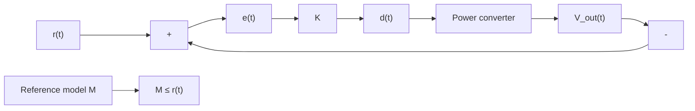

K = \left[ \begin{array}{c c c c c c} L _ {1} & 0 & 0 & 0 & 0 & 0 \\ 0 & L _ {2} & 0 & 0 & 0 & 0 \\ 0 & 0 & C _ {1} & 0 & 0 & 0 \\ 0 & 0 & 0 & C _ {2} & 0 & 0 \\ 0 & 0 & 0 & 0 & C _ {I N} & 0 \\ 0 & 0 & 0 & 0 & 0 & C _ {o u t} \end{array} \right], \qquad B _ {0} = \left[ \begin{array}{c c} \frac {R _ {c}}{R _ {c} + R _ {\mathrm{IN}}} & 0 \\ \frac {R _ {c}}{R _ {c} + R _ {\mathrm{IN}}} & 0 \\ 0 & 0 \\ 0 & 0 \\ \frac {1}{R _ {c} + R _ {\mathrm{IN}}} & 0 \\ 0 & 1 \end{array} \right] \qquad B _ {1} = \left[ \begin{array}{c c} \frac {R _ {c}}{R _ {c} + R _ {\mathrm{IN}}} & 0 \\ \frac {R _ {c}}{R _ {c} + R _ {\mathrm{IN}}} & 0 \\ 0 & 0 \\ 0 & 0 \\ 0 & 0 \\ 0 & 0 \end{array} \right] \qquad C = [ \begin{array}{c c c c c c c c c} 0 & 0 & 0 & 0 & 0 & 1 \end{array} ]
$$

Table II: Matrices of the average state-space model (1)   

flowchart

Figure 5: Principle of VRFT[3]

The VRFT follows the five steps detailed hereafter :
