# C. Extended VRFT With Anti-Windup Compensation

In order to improve the closed-loop performances, an antiwindup compensation is included in the designed controller, following the VRFT extension proposed in [12]. Anti-windup is commonly used in control systems to prevent the integrator from accumulating error when the controller output becomes saturated. While there are several anti-windup methods, the one adopted here [5] uses the difference between the saturated input and the actual control input to regulate the behavior of the integral action in order to avoid windup phenomenon. Such control structure is illustrated on Figure 11. The duty cycle $d _ { s a t } ( t )$ that is actually sent to the power converter is given by :

$$
d _ {s a t} (t) = \left\{ \begin{array}{l l} 0. 9 & \text { if } d (t) > 0. 9 \\ 0. 1 & \text { if } d (t) <   0. 1 \\ d (t) & \text { otherwise } \end{array} \right. \tag {10}
$$

flowchart

```mermaid
graph TD
    A["r(t)"] --> B["+"]
    B --> C["e(t)"]
    C --> D["Kp"]
    D --> E["+"]
    E --> F["d(t)"]
    F --> G["d_a(t)"]
    G --> H["Power converter"]
    H --> I["V_a(t)"]
    I --> J["-"]
    J --> K["KAW"]
    K --> L["+"]
    L --> M["v_a(t)"]
    M --> N["+"]
    N --> O["d(a(t))"]
    O --> P["d_a(t)"]
    P --> Q["Power converter"]
    Q --> R["V_a(t)"]
    R --> S["-"]
    S --> T["KAW"]
    T --> U["+"]
    U --> V["v_a(t)"]
    V --> W["+"]
    W --> X["d(a(t))"]
    X --> Y["d_a(t)"]
    Y --> Z["Power converter"]
    Z --> AA["V_a(t)"]
    AA --> AB["-"]
    AB --> AC["KAW"]
    AC --> AD["+"]
    AD --> AE["v_a(t)"]
    AE --> AF["+"]
    AF --> AG["d(a(t))"]
    AG --> AH["D_a(t)"]
    AH --> AI["Power converter"]
    AI --> AJ["V_a(t)"]
```

Figure 11: The PI controller with Anti-Windup

As shown in Figure 11, the controlled output $d ( t )$ is given by:

$$d (t) = \left(K _ {p} \cdot e (t)\right) + K _ {I} \int e (t) d t + K _ {I} K _ {A W} \sum_ {j = 1} ^ {n _ {A w}} u _ {d} (t - j) \tag {11}$$
