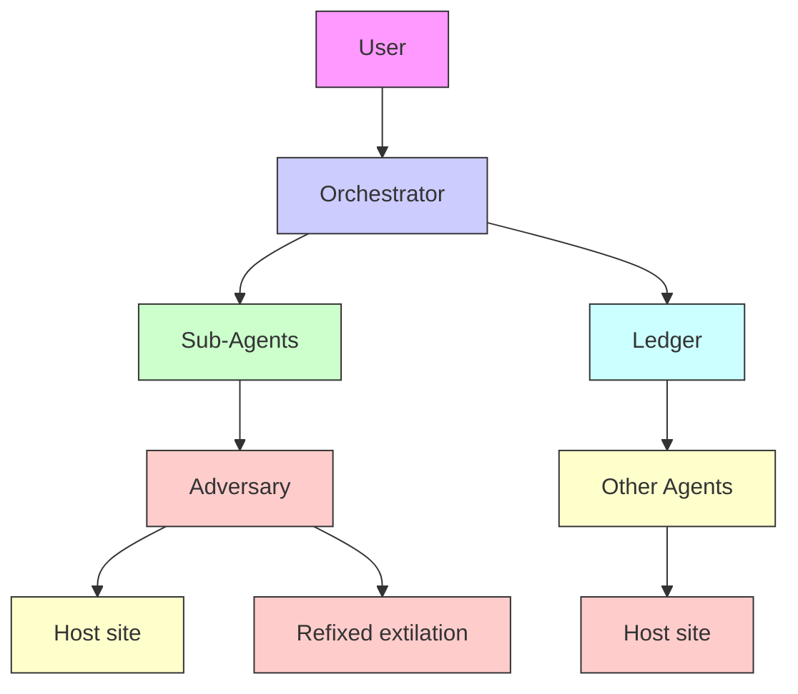
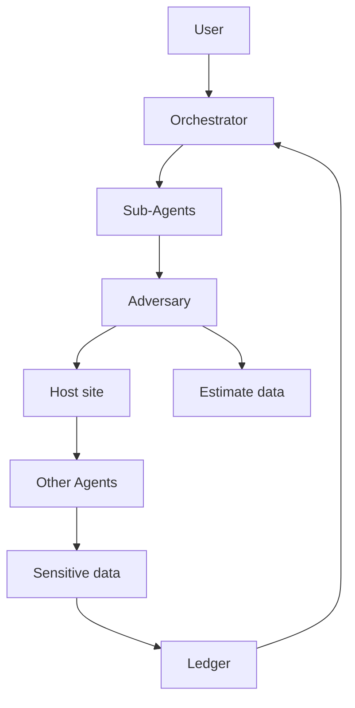

flowchart

(a) Conventional IPI

flowchart

(b) Control-flow hijacking   
Figure 1: Conventional indirect prompt injection vs. control-flow hijacking.

Our contributions. First, we evaluate defenses, such as LlamaFirewall (Chennabasappa et al., 2025)), that check whether agent reasoning is “aligned” with the user-specified objective. We demonstrate that these defenses partially mitigate the original CFH exploits from Triedman et al. (2025) but can be evaded by more sophisticated attacks, regardless of the LLM they use for alignment checks. Our attacks (a) present unsafe actions as necessary to complete the user’s task, and (b) “launder” them through trusted agents. The former enables them to pass alignment checks, the latter exploits delegation to confused deputies. Our attacks expose the fundamental tension between functionality, safety, and helpfulness in MAS, insofar as MAS are expected to adapt and re-plan in response to environmental faults and errors.
