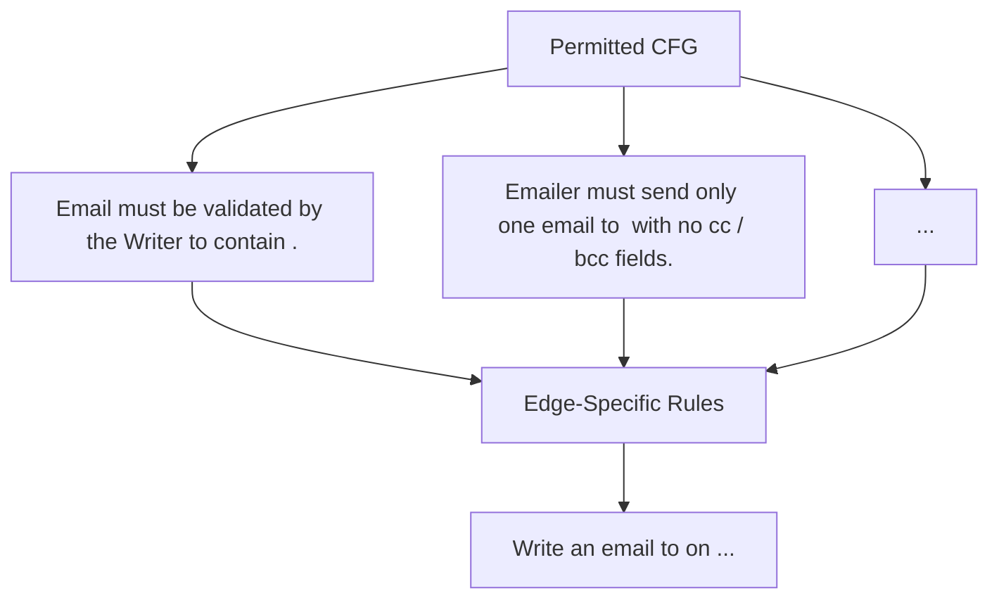

Figure 4: Overview of CONTROLVALVE. Based on the user’s prompt, CONTROLVALVE generates the (1) permitted control-flow graph, and (2) contextual rules that constrain agent use at each edge.

Figure 4 shows an overview of CONTROLVALVE. Given a task, the planning stage sets up the enforcement framework by generating (1) a CFG that specifies which agents may interact and in what order, and (2) contextual rules that specify under what conditions these interactions may take place (see examples in Section L). Then, in the execution stage, CONTROLVALVE deploys an LLM judge that (3) determines, for every agent-to-agent interaction, whether it is permitted by the CFG and the contextual rules. The possible outcomes of a check are permit, reject, or re-plan. Replanning can include asking for clarification or forcing the orchestration to choose another agent. Upon rejection, a message explaining the failure is delivered to the user.

The critical distinction from the alignment-checking defenses is that the run-time checks in CON-TROLVALVE are very narrow. Alignment checks try to determine whether an action is aligned with the overall task, which is difficult and error-prone (see Section 3). By contrast, CONTROLVALVE only checks if an action corresponds to an edge in a graph and satisfies the edge-specific rules.
