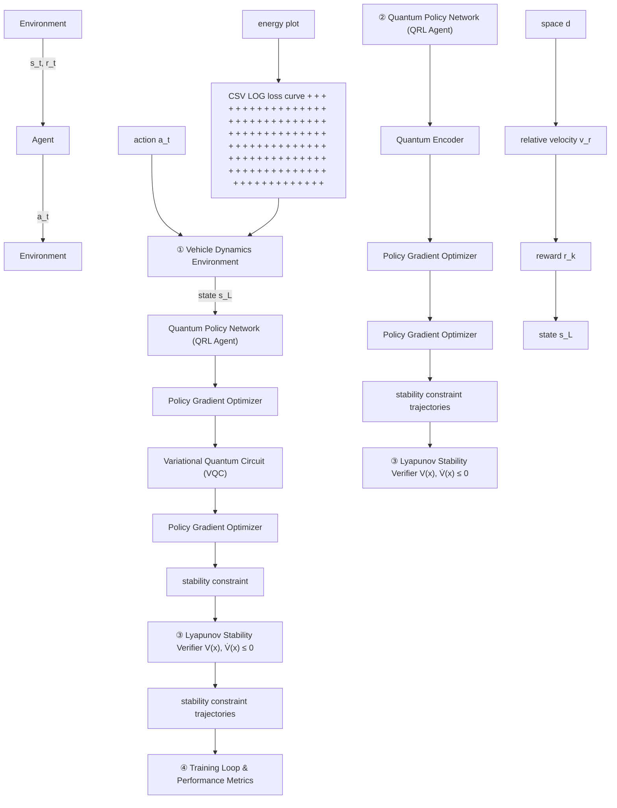

# D. Discussion and Observations

The obtained results indicate that the proposed LQRL framework successfully integrated quantum-inspired policy learning with Lyapunov-based safety constraints. However, the recorded data show that the control policy exhibited partial instability under high-speed conditions. The large deviation in $z ( t )$ and the growth of $\dot { V } ( x )$ highlight that the current penalty coefficient λ was insufficient to enforce strict stability during transient responses. It is therefore inferred that dynamic gain adaptation, normalization of the Lyapunov function, or stochastic regularization should be introduced in future implementations to strengthen stability guarantees.

Despite the observed deviation, the simulation confirmed the feasibility of embedding Lyapunov stability verification within a quantum policy network. The framework demonstrated the ability to learn control actions that balance performance and stability in a continuous-time domain, providing a foundation for future extensions toward real-time, provably safe quantum reinforcement learning in autonomous vehicle control applications.

flowchart

Fig. 2. System overview of the proposed LQRL framework integrating quantum policy, Lyapunov stability, and continuous vehicle dynamics.

bar

| Value | Label |
| --- | --- |
| -292.68 m | v_rel: -45.59 m/s |
| 56.19 m/s | v_e: |
| 3.00 m/s^2 | u (ego accel): a_lead: -0.73 m/s^2 |
| 42814.990 dV/dt: 14333.220 | V(x): |
| 30.00s | time: |

Fig. 3. Graphical simulation in Pygame showing the ego (blue) and lead (green) vehicles in the adaptive cruise control scenario.
