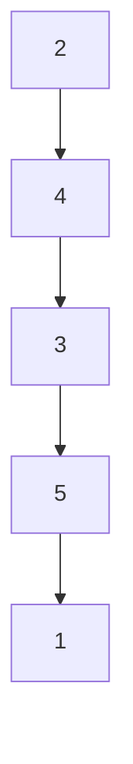

# VI. NUMERICAL RESULTS

The parameters used in the numerical examples are: $\beta =$ 0.3, $T = 1 0 , \ c = 2 0 0$ . For the clarity of illustrations, we select n = 5 (a much larger n is possible for control based on TransNNs, but not feasible for MDP solutions). The network structure and transmission probabilities are illustrated in Fig. 1.

flowchart

heatmap

| Node Index (in) \ Node Index (out) | 1 | 2 | 3 | 4 | 5 |
| --- | --- | --- | --- | --- | --- |
| 5 | 0.75 | 0.60 | 0.45 | 0.30 | 0.15 |
| 4 | 0.60 | 0.45 | 0.30 | 0.15 | 0.05 |
| 3 | 0.45 | 0.30 | 0.15 | 0.05 | 0.00 |
| 2 | 0.30 | 0.15 | 0.05 | 0.00 | 0.00 |
| 1 | 0.15 | 0.05 | 0.00 | 0.00 | 0.00 |

Fig. 1: A network example with 5 nodes (left) and the transmission probabilities (right) among nodes.

heatmap

State Evolution (MDP)
| Node Index | Time Step (k) | State Value |
| --- | --- | --- |
| 1 | 0 | 0.8 |
| 2 | 1 | 0.6 |
| 3 | 2 | 0.4 |
| 4 | 3 | 0.2 |
| 5 | 4 | 0.0 |
| 6 | 5 | 0.0 |
| 7 | 6 | 0.0 |
| 8 | 7 | 0.0 |
| 9 | 8 | 0.0 |
| 10 | 9 | 0.0 |

heatmap

Control Actions (MDP)
| Node Index | 0 | 1 | 2 | 3 | 4 | 5 |
| --- | --- | --- | --- | --- | --- | --- |
| 1 | 0.8 | 0.9 | 0.7 | 0.6 | 0.5 | 0.4 |
| 2 | 0.8 | 0.9 | 0.7 | 0.6 | 0.5 | 0.4 |
| 3 | 0.8 | 0.9 | 0.7 | 0.6 | 0.5 | 0.4 |
| 4 | 0.8 | 0.9 | 0.7 | 0.6 | 0.5 | 0.4 |
| 5 | 0.8 | 0.9 | 0.7 | 0.6 | 0.5 | 0.4 |

Fig. 2: Control actions (right) generated from the MDP control, and actual state realizations (left) the under such control actions.

heatmap

