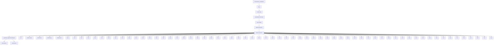

```mermaid
graph TD
    A["iDrone/motor_commands"] --> B["Msg"]
    B --> C["motor_msg"]
    C --> D["parseMotorCommands"]
    D --> E["Motor Model"]
    E --> F["Attitude Dynamics"]
    F --> G["Position Dynamics"]
    G --> H["geometry_msgs/PoseStamped"]
    H --> I["/drone/immu"]
    H --> J["/drone/immu"]
    G --> K["bus"]
    G --> L["header.stamp"]
    G --> M["twist.linear.x"]
    G --> N["twist.linear.y"]
    G --> O["twist.linear.z"]
    G --> P["bus"]
    G --> Q["bus"]
    G --> R["bus"]
    G --> S["bus"]
    G --> T["bus"]
    G --> U["bus"]
    G --> V["bus"]
    G --> W["bus"]
    G --> X["bus"]
    G --> Y["bus"]
    G --> Z["bus"]
    G --> AA["bus"]
    G --> AB["bus"]
    G --> AC["bus"]
    G --> AD["bus"]
    G --> AE["bus"]
    G --> AF["bus"]
    G --> AG["bus"]
    G --> AH["bus"]
    G --> AI["bus"]
    G --> AJ["bus"]
    G --> AK["bus"]
    G --> AL["bus"]
    G --> AM["bus"]
    G --> AN["bus"]
    G --> AO["bus"]
    G --> AP["bus"]
    G --> AQ["bus"]
    G --> AR["bus"]
    G --> AS["bus"]
    G --> AT["bus"]
    G --> AU["bus"]
    G --> AV["bus"]
    G --> AW["bus"]
    G --> AX["bus"]
    G --> AY["bus"]
    G --> AZ["bus"]
    G --> BA["bus"]
    G --> BB["bus"]
    G --> BC["bus"]
    G --> BD["bus"]
    G --> BE["bus"]
    G --> BF["bus"]
    G --> BG["bus"]
    G --> BH["bus"]
    G --> BI["bus"]
    G --> BJ["bus"]
    G --> BK["bus"]
    G --> BL["bus"]
    G --> BM["bus"]
    G --> BN["bus"]
    G --> BO["bus"]
    G --> BP["bus"]
    G --> BQ["bus"]
    G --> BR["bus"]
    G --> BS["bus"]
    G --> BT["bus"]
    G --> BU["bus"]
    G --> BV["bus"]
    G --> BW["bus"]
    G --> BX["bus"]
    G --> BY["bus"]
    G --> BZ["bus"]
```

Figure 2 Block diagram of the Simulink model
