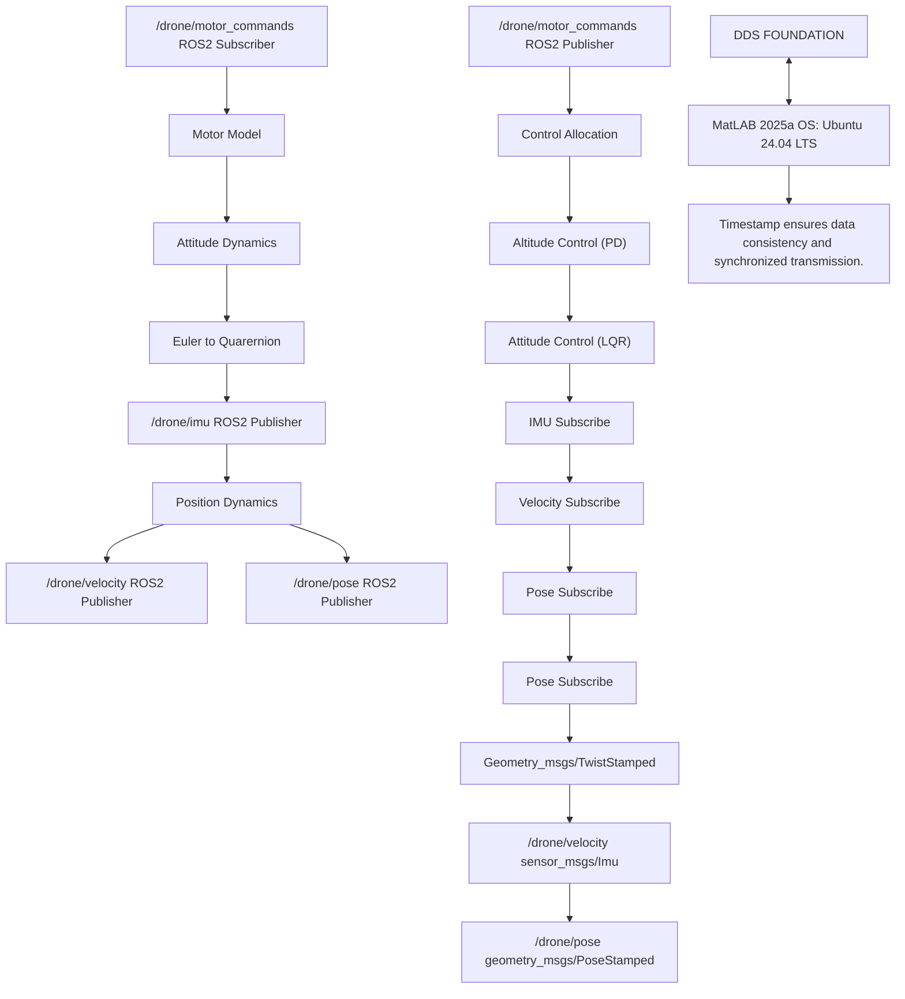

```mermaid
graph TD
    A["/drone/motor_commands ROS2 Subscriber"] --> B["Motor Model"]
    B --> C["Attitude Dynamics"]
    C --> D["Euler to Quarernion"]
    D --> E["/drone/imu ROS2 Publisher"]
    E --> F["Position Dynamics"]
    F --> G["/drone/velocity ROS2 Publisher"]
    F --> H["/drone/pose ROS2 Publisher"]
    I["/drone/motor_commands ROS2 Publisher"] --> J["Control Allocation"]
    J --> K["Altitude Control (PD)"]
    K --> L["Attitude Control (LQR)"]
    L --> M["IMU Subscribe"]
    M --> N["Velocity Subscribe"]
    N --> O["Pose Subscribe"]
    O --> P["Pose Subscribe"]
    P --> Q["Geometry_msgs/TwistStamped"]
    Q --> R["/drone/velocity sensor_msgs/Imu"]
    R --> S["/drone/pose geometry_msgs/PoseStamped"]
    T["DDS FOUNDATION"] <--> U["MatLAB 2025a OS: Ubuntu 24.04 LTS"]
    U --> V["Timestamp ensures data consistency and synchronized transmission."]
```

Figure 3 The co-simulation framework architecture
