```mermaid
graph TD
    A["Data Collection"] -->|Input-state Trajectories| B["Clustering"]
    B -->|Cluster Identity| C["Robust Multitask SysID"]
    C -->|Model Estimate| D["Controller Design"]
    D -->|Controller| A
    E["Adversarial misclassifications"] -->|Updates| C
    F["Cluster"] --> B
    G["Identity"] --> B
    H["Isometric"] --> B
    I["Isometric"] --> C
    J["Isometric"] --> C
    K["Isometric"] --> C
    L["Isometric"] --> C
    M["Isometric"] --> C
    N["Isometric"] --> C
    O["Isometric"] --> C
    P["Isometric"] --> C
    Q["Isometric"] --> C
    R["Isometric"] --> C
    S["Isometric"] --> C
    T["Isometric"] --> C
    U["Isometric"] --> C
    V["Isometric"] --> C
    W["Isometric"] --> C
    X["Isometric"] --> C
    Y["Isometric"] --> C
    Z["Isometric"] --> C
    AA["Isometric"] --> C
    AB["Isometric"] --> C
    AC["Isometric"] --> C
    AD["Isometric"] --> C
    AE["Isometric"] --> C
    AF["Isometric"] --> C
    AG["Isometric"] --> C
    AH["Isometric"] --> C
    AI["Isometric"] --> C
    AJ["Isometric"] --> C
    AK["Isometric"] --> C
    AL["Isometric"] --> C
    AM["Isometric"] --> C
    AN["Isometric"] --> C
    AO["Isometric"] --> C
    AP["Isometric"] --> C
    AQ["Isometric"] --> C
    AR["Isometric"] --> C
    AS["Isometric"] --> C
    AT["Isometric"] --> C
    AU["Isometric"] --> C
    AV["Isometric"] --> C
    AW["Isometric"] --> C
    AX["Isometric"] --> C
    AY["Data Collection"] --> AZ["Cluster Identity"]
    AZ --> BA["Robust Multitask SysID"]
    BA --> BB["Controller Design"]
```

Figure 1: Workflow for adversarially robust multitask adaptive control†.

Wang et al., 2023a, Toso et al., 2023, Ke¸ceci et al., 2025a]. When the systems are homogeneous or share some model structure (e.g., a model basis), joint estimation yields improvements in sample complexity [Zhang et al., 2024]. On the other hand, when systems are only approximately similar, an additive heterogeneity bias emerges [Wang et al., 2023a]. As the primary source of regret in adaptive control stems from identification, multitask identification offers a natural path to surpass the O( T ) scaling limit from the single-task setting.
