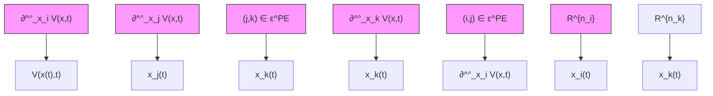

$$
\begin{array}{l} L _ {X} ^ {\circ} V (x, t) = \sup _ {\nu \in \partial_ {x} ^ {\circ} V} \nu \dot {x} = \sup _ {\nu \in \partial_ {x} ^ {\circ} V} \sum_ {i \in \mathcal {N}} \nu_ {i} \dot {x} _ {i} \\ \leq \sum_ {i \in \mathcal {N}} \sup _ {\nu \in \partial_ {x} ^ {\circ} V} \nu_ {i} \dot {x} _ {i} = \sum_ {i \in \mathcal {N}} \sup _ {\nu_ {i} \in \partial_ {x _ {i}} ^ {\circ} V} \nu_ {i} \dot {x} _ {i}, \\ \end{array}
$$

flowchart

Figure 2. Illustration of the control synthesis framework (19), where the edge (i.j) is undirected while (j, k) is directed.

where $X = [ X _ { 1 } ^ { \top } , \ldots , X _ { N } ^ { \top } ] ^ { \top }$ , then we can obtain

$$
\begin{array}{l} L _ {X} ^ {\circ} V (x, t) + \frac {\partial}{\partial t} V (x, t) \\ + \sum_ {i \in \mathcal {N}} \alpha \left(V _ {i} ^ {\mathrm{PE}} (x _ {i}, \{x _ {j} \} _ {j \in \mathcal {N} _ {i} ^ {\mathrm{PE}}}, t)\right) \leq 0, \quad \forall t \geq 0. \\ \end{array}
$$

Since α is assumed to be a subadditive class K function here, we have

$$L _ {X} ^ {\circ} V (x, t) + \frac {\partial}{\partial t} V (x, t) + \alpha (V (x, t)) \leq 0, \quad \forall t \geq 0.$$

Hence, using Theorem III.1, the proof is completed.

Also, Theorem IV.2 can be utilized for control synthesis through the following optimization framework, as illustrated in Fig. 2.

$$
\begin{array}{l} \underset {u _ {i} \in \mathcal {U} _ {i}} {\arg \min} H _ {i} (u _ {i}, x _ {i}, \{x _ {j} \} _ {j \in \mathcal {N} _ {i} ^ {\mathrm{PE}}}, t) \\ \text { s.t. } \quad \max _ {\nu_ {i} \in \partial_ {x _ {i}} ^ {\circ} V} \nu_ {i} \dot {x} _ {i} + \frac {\partial}{\partial t} V _ {i} ^ {\mathrm{PE}} + \alpha (V _ {i} ^ {\mathrm{PE}}) \leq 0, \tag {19} \\ \end{array}
$$
