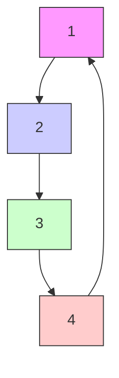
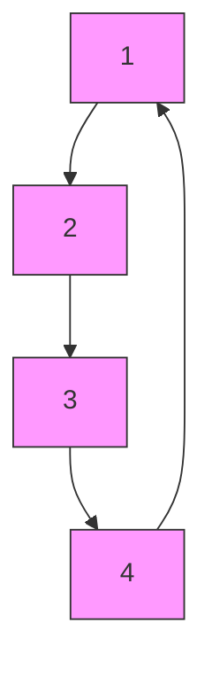

The CBF for Robot i to avoid colliding with Obstacle k ∈ $\mathcal { K } : = [ 1 , 2 , \dotsc , K ]$ with $K \in \mathbb { Z } ^ { + }$ is given by $h _ { i } ^ { k } ( x _ { i } ) = \parallel x _ { i } -$ $c _ { k } \| ^ { 2 } - r _ { k } ^ { 2 }$ , where $c _ { k } \in \mathbb { R } ^ { 2 }$ and $r _ { k } ~ > ~ 0$ are the center and radius of Obstacle k respectively. The corresponding CBFinduced constraint can be directly obtained using Lemma III.2. In addition, the CBF for Robot i to avoid colliding with Robot j is defined as

$$h _ {i j} ^ {\mathrm{SE}} (x _ {i}, x _ {j}) = \| x _ {i} - x _ {j} \| ^ {2} - D _ {i j} ^ {2}, \tag {32}$$

where $D _ { i j } ~ > ~ 0$ is the safe distance between Robots i and $j .$ Note that (32) is a shared-entangled CBF (SE-CBF) that involves the states of both Robots i and $j ,$ , as defined below.

Definition V.1. Given an SE graph $\mathcal { G } ^ { \mathrm { S E } } = ( \mathcal { N } ^ { \mathrm { S E } } , \mathcal { E } ^ { \mathrm { S E } } )$ per Definition IV.1, a CBF $h _ { \mathcal { N } ^ { \mathrm { S E } } } : \mathbb { R } ^ { \sum _ { i \in \mathcal { N } ^ { \mathrm { S E } } } n _ { i } }  \mathbb { R }$ is called an SE-CBF if it depends only on $\{ x _ { i } \} _ { i \in \mathcal { N } ^ { \mathrm { S E } } }$ .

Thus, the constraint allocation strategy in (15), adapted into the formulation of CBF, can be utilized to achieve decentralized implementation. Specifically, the framework (20) with the time-invariant setting and slack variables in this subsection takes the form of

text_image

3
4
2
1

(a) Time Step 1

text_image

3
4
2
1

(b) Time Step 500

flowchart

(c) Time Step 1000

flowchart

