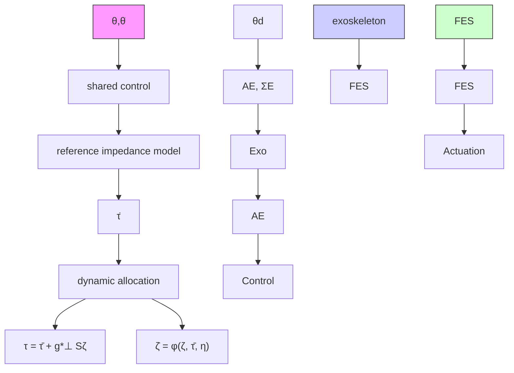

$$\pmb {\tau} = [ \alpha \pmb {\sigma}, 1 - \alpha ] ^ {\top} \tau^ {N} + \pmb {c} \tau^ {C},\boldsymbol {\sigma} (\tau^ {N}) = [ h (\tau^ {N}), 1 - h (\tau^ {N}) ], \tag {7}\boldsymbol {c} = [ 1, - 1, 0 ] ^ {\top},$$

where $\tau ^ { N } = \mathbf { 1 } ^ { \top } \tau \in \mathbb { R }$ represents net control torque at the redundantly actuated joint j and α represents the cooperative gain, which defines the contribution of different sources of torque in inducing net joint torque. α is defined as the ratio of the FES-induced torque to the net control torque

flowchart

Fig. 1: Control architecture of the hybrid FES-exoskeleton system. The proposed dynamic allocation scheme distributes the control torque, determined by the shared control, among the actuators. The adaptation of the cooperative control coefficient is based on the attainable set of both assistive devices. The attainable set of FES-induced control torque, $\mathbb { A } _ { F } ,$ and attainable set of exoskeleton control torque, $\mathbb { A } _ { E } ,$ consists of constraints of two actuators. FES-torque model, $\Sigma _ { F }$ , and attainable sets of FES, $\mathbb { A } _ { F }$ , learned from user data, are used in the low-level FES control and dynamic allocation, respectively.

$$\alpha = \frac {\tau^ {F}}{\tau^ {N}}. \tag {8}$$

Note that the ratio is undefined when $\tau ^ { N } = 0 ;$ ; however, for implementation purposes, we retain the last valid value of α in such cases.

Furthermore, σ can be interpreted as a FES-induced muscle torque distributor that allocates the FES control effort between the flexor and extensor muscles.
