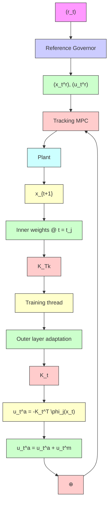

Fig. 1: Deep MPC has a neural network in the loop with MPC in which the outermost layer is adapted at each time instant and its output is stored in a replay buffer to create training dataset to train its inner layers intermittently in a remote training thread.

handle only bounded disturbances (i.e., the DNN outputs), this constraint is also crucial for mitigating the parameter drift phenomenon commonly encountered in adaptive control.

Parameter drift phenomenon also reminds the crash of X-15 in October 1967 in which the pilot Michael Adams died and due to the incident flight testing of adaptive control stopped for around the next thirty years [6]. However, several new methods of robust adaptive control have also been developed later. One of the approaches to avoid the parameter drift phenomenon is based on projecting the learned weights on a bounded set.
