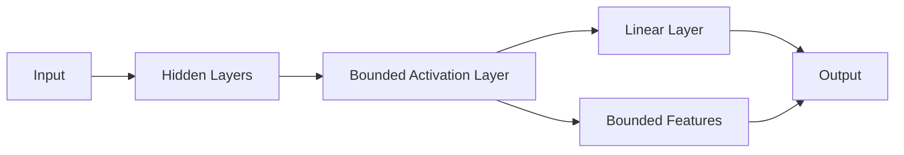

# V. Numerical experiment

We consider a continuous time simplified non-slip fourwheeled skid-steer dynamics of the robot, which is used in [2], [25], [26] for robot navigation in an agricultural crop field. The states of the robots are represented by $\overline { { s } } : = \left[ x \quad y \quad \dot { \theta } \quad v \quad \omega \right] ^ { \top }$ , where $x \in [ - 2 , 1 ]$ is the robot’s longitudinal position across the lane, $y \in \left[ - 0 . 5 , 0 . 5 \right]$ is the lateral position (cross-track error), $\theta \in \left[ - \pi / 2 , \pi / 2 \right]$ is the heading angle with respect to the lane, $v \in [ - 1 . 5 , 1 . 5 ]$ is the difference between the speed of the robot and the reference speed $v _ { r } = 0 . 8 ,$ , and $\omega \in [ - 3 , 3 ]$ is the robot’s angular rate. The control $\boldsymbol { u } : = \left[ F _ { L } \quad F _ { R } \right] ^ { \intercal }$ , where $F _ { L } , F _ { R } \in [ - 1 0 , 1 0 ]$ are the left and right exerted forces used to move the robot’s wheels. The continuous time dynamics is given by

$$
\left[ \begin{array}{c} \dot {x} \\ \dot {y} \\ \dot {\theta} \\ \dot {v} \\ \dot {\omega} \end{array} \right] = \left[ \begin{array}{c} (v + v _ {r}) \cos \theta \\ (v + v _ {r}) \sin \theta \\ \omega \\ 0 \\ 0 \end{array} \right] + \left[ \begin{array}{c c} 0 & 0 \\ 0 & 0 \\ 0 & 0 \\ \frac {1}{M} & \frac {1}{M} \\ - \frac {b}{I} & \frac {b}{I} \end{array} \right] \left(\left[ \begin{array}{c} F _ {L} \\ F _ {R} \end{array} \right] - R\right), \tag {11}
$$

where the constants $M = 1 5 , I = 0 . 1$ , and $b = 0 . 1$ are the robot’s physical properties that correspond to the mass, moment of inertia, and distance between wheels. The continuous time dynamics is discretized by using the sampling time $T _ { s } = 0 . 0 5$ seconds to get the dynamics of the form (1).

flowchart

Fig. 2: The neural network architecture used in Deep MPC.
