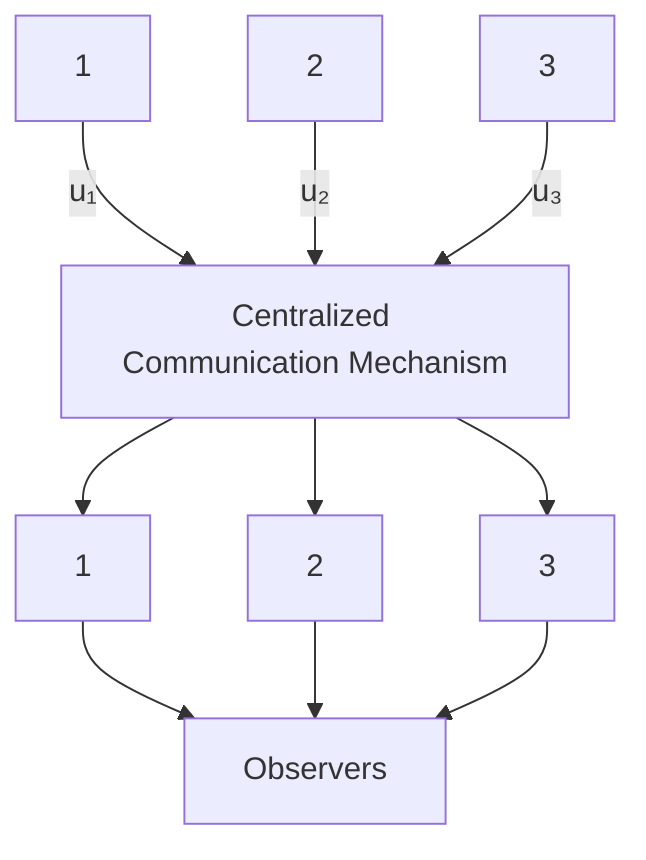

# B. Distributed Stabilization Problem

Modern industrial systems usually have a number of components or subsystems, and are typically equipped with multiple sensors and actuators. For such systems, there has been a spontaneous research interest in studying the distributed (also referred to as decentralized) stabilization problem [2, 3]. The problem is formulated as follows. Consider a multi-channel linear system governed by

$$\dot {x} = A x + \sum_ {i = 1} ^ {\bar {N}} B _ {i} u _ {i}y _ {i} = C _ {i} x, i = 1, 2, \dots \bar {N},$$

where ??¯ agents are involved. The ??th agent measures local output ???? and applies local control input ???? to the system. The control objective is to drive the system state to the origin.

With the separation principle in mind, the first thought may well be designing controllers with the help of distributed observers. Recently developed consensus-based distributed observers [4, 5] enable each agent to reconstruct the full state of the system. However, most distributed observers in the existing literature are designed for systems without inputs. When systems are subject to control inputs, those distributed observers fail to work unless each observer node has full access to the control inputs of the entire system. For case ${ \bar { N } } = 3 .$ , Fig. 1 illustrates how global control inputs are delivered to each observer node through a centralized communication mechanism. The limitations of this type of design are as follows:

flowchart

Fig. 1. Diagram of delivering all the control inputs to every observer node.
