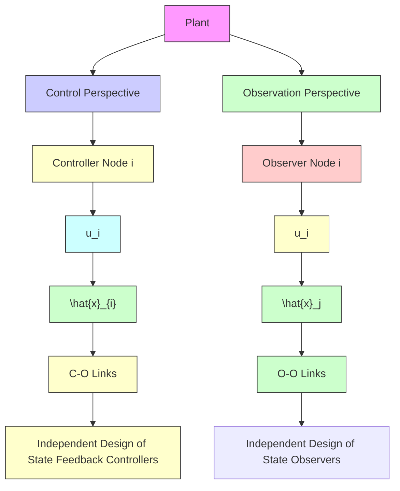

# E. Main Assumptions

Assumption 1. The unknown input ??(??) is bounded, i.e., $\operatorname* { m a x } _ { \mathbf { \epsilon } _ { \epsilon } } \| \nu ( t ) \| \leq \bar { \nu } .$ .

Assumption 2. For each observer node ??, the portion of the input unavailable to that node is bounded, $i . e . , \operatorname* { m a x } _ { t } \| u _ { - i } ( t ) \| \leq$ $\bar { u } _ { - i } , \ \forall i \in \{ 1 , 2 , \cdot \cdot \cdot , N \}$ .

Assumption 3. The pair ( ??, ??) is stabilizable.

Assumption 4. The channels of the control input and unknown input are matched; that $i s ,$ there exists a matrix $X _ { \nu }$ such that $B X _ { \nu } = B _ { \nu }$ .

Assumption 5. The observer nodes communicate according to a connected graph $\mathcal { G } .$ .

Assumption 6. The matrix triplet $( A , B _ { - i } , C _ { i } )$ is collectively strongly detectable, i.e., $\begin{array} { r } { \sum _ { i = 1 } ^ { N } \bar { \mathrm { I m } T _ { i d } } = \mathbb { R } ^ { n } } \end{array}$ .

flowchart

Fig. 2. Overall architecture of the proposed distributed observer-based control framework.
