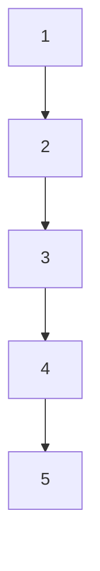

# C. Numerical Example

Consider a heterogeneous multi-agent system (19) composed of five agents, whose system matrices are

$$\check {A} _ {1} = \check {A} _ {2} = 0, \check {B} _ {1} = \check {B} _ {2} = 1, \check {C} _ {1} = \check {C} _ {2} = 1
\check {A} _ {3} = \check {A} _ {4} = \left[ \begin{array}{c c} 0 & 1 \\ 0 & 0 \end{array} \right], \check {B} _ {3} = \check {B} _ {4} = \left[ \begin{array}{c} 0 \\ 1 \end{array} \right], \check {C} _ {3} ^ {\top} = \check {C} _ {4} ^ {\top} = \left[ \begin{array}{c} 1 \\ 0 \end{array} \right]

\check {A} _ {5} = \left[ \begin{array}{c c c} 0 & 1 & 0 \\ 0 & 0 & 1 \\ 0 & 0 & 0 \end{array} \right], \check {B} _ {5} = \left[ \begin{array}{c} 0 \\ 0 \\ 1 \end{array} \right], \check {C} _ {5} ^ {\top} = \left[ \begin{array}{c} 1 \\ 0 \\ 0 \end{array} \right].
$$

Set the initial states of the agents as

$$
\check {x} _ {1} (0) = - 1, \check {x} _ {2} (0) = - 2, \check {x} _ {3} (0) = \left[ \begin{array}{c c} - 3 & - 4 \end{array} \right] ^ {\top}

\check {x} _ {4} (0) = \left[ \begin{array}{c c} 5 & 4 \end{array} \right] ^ {\top}, \check {x} _ {5} (0) = \left[ \begin{array}{c c c} 3 & 2 & 1 \end{array} \right] ^ {\top}.
$$

Set the control inputs as

$$u _ {i} = 0. 5 (i - 1) \sin [ (6 - i) t ], i = 1, 2, 3, 4, 5.$$

In observer node dynamics (20), design gain $\breve { L } _ { i }$ as

$$\breve {L} _ {i} = - \breve {X} _ {i} \breve {C} _ {i} ^ {\top}, i = 1, 2, 3, 4, 5,$$

where $\breve { X } _ { i }$ is the unique solution of algebraic Riccati equation

$$(\breve {A} _ {i} + 0. 2 I) \breve {X} _ {i} + \breve {X} _ {i} (\breve {A} _ {i} + 0. 2 I) ^ {\top} - \breve {X} _ {i} \breve {C} _ {i} ^ {\top} \breve {C} _ {i} \breve {X} _ {i} + I = 0.$$

For adaptive gains $\gamma _ { i }$ and $\gamma _ { i s } ,$ set their initial values as

$$\gamma_ {i} (0) = \gamma_ {i s} (0) = 0. 1$$

and update step sizes as

$$\phi_ {i} = 0. 2, \phi_ {i s} = 0. 5, i = 1, 2, 3, 4, 5.$$

Let the agents communicate with each other according to the graph shown in Fig. 3, in which the weights of edges are all set as 1. The simulation results in Fig. 4 show that each agent is able to correctly estimate the states of all agents. Results in Fig. 5 and Fig. 6 show that adaptive gains are bounded all the time.

flowchart

Fig. 3. O-O Links in Section III-C.

