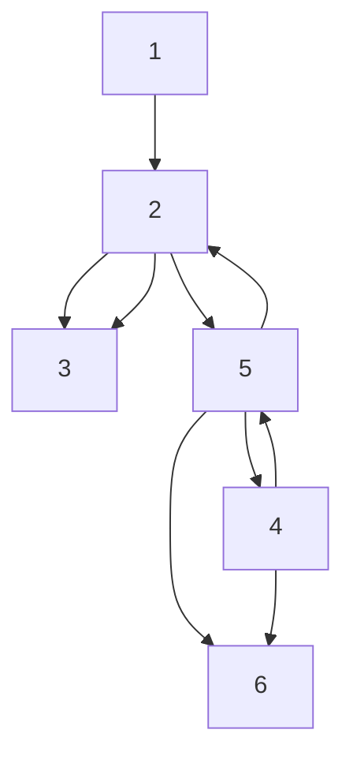

Accordingly, $B _ { - i }$ can be determined. Based on the algorithm provided in Section VII-A, it can be obtained that

$$
\begin{array}{l} T _ {1 d} = \left[ \begin{array}{c c c c c c c c c} 1 & 0 & 0 & 0 & 0 & 0 & 0 & 0 & 0 \end{array} \right] ^ {\top} \\ T _ {2 d} = \left[ \begin{array}{c c c c c c c c c} 0 & 0 & 0 & 0 & 0 & 0 & 0. 5 & - 0. 7 0 7 1 & 0. 5 \\ 0 & 0 & 0 & - 0. 7 0 7 1 & 0 & 0 & 0. 5 & 0 & - 0. 5 \\ 0 & 0 & - 1 & 0 & 0 & 0 & 0 & 0 & 0 \end{array} \right] ^ {\top} \\ T _ {3 d} = \left[ \begin{array}{c c c c c c c c c} 0 & 0 & 0 & 0 & 0 & - 1 & 0 & 0 & 0 \\ 0 & 0 & 0 & 0 & 1 & 0 & 0 & 0 & 0 \end{array} \right] ^ {\top} \\ T _ {4 d} = \left[ \begin{array}{c c c c c c c c c} 0 & 0 & 0 & 0 & 0 & 0 & 0 & 1 & 0 \\ 0 & 0 & 0 & 0 & 0 & 0 & 0 & 0 & 1 \\ 0 & 0 & 0 & 0 & 0 & 0 & - 1 & 0 & 0 \end{array} \right] ^ {\top} \\ T _ {5 d} = \left[ \begin{array}{c c c c c c c c c} 0 & 1 & 0 & 0 & 0 & 0 & 0 & 0 & 0 \end{array} \right] ^ {\top} \\ T _ {6 d} = \left[ \begin{array}{c c c c c c c c c} 0 & 0 & 0 & 1 & 0 & 0 & 0 & 0 & 0 \end{array} \right] ^ {\top}. \\ \end{array}
$$

For brevity, the values of matrices $E _ { i } , ~ F _ { i } , ~ G _ { i }$ are not listed here. The adaptive gains $\gamma _ { i }$ and $\gamma _ { i s }$ are initialized as:

$$\gamma_ {i} (0) = \gamma_ {i s} (0) = 0. 1$$

and their update step sizes are chosen as

$$\phi_ {i} = 0. 2, \phi_ {i s} = 0. 5, i = 1, 2, 3, 4, 5, 6.$$

The observer nodes communicate according to the graph1 3 5 shown in Fig. 7, in which the weights of edges are all set as 1. The simulation results in Fig. 8 and Fig. 9 show that

flowchart

Fig. 7. O-O links in Section IV-B and V-B.

3the tracking error and state estimation errors converge to zero. The adaptive gains remain bounded throughout the simulation, as shown in Fig. 10 and Fig. 11.

To demonstrate the indispensability of the discontinuous term in (17), we set $\gamma _ { i s } ( 0 ) = 0$ and $\phi _ { i s } = 0$ with other settings unchanged. As shown in Fig. 12 and Fig. 13, under this modification, neither the tracking error nor the state estimation errors converge to zero.
