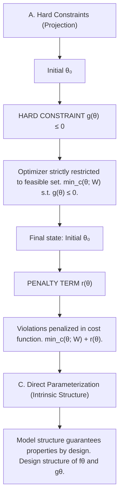

where $\epsilon > 0$ is a small constant.

ϵ >With the above formulation in hand, we can now survey and classify approaches for imposing control-relevant and physicsinformed structures into system identification proposed in the literature, in the context of both classical system identification and learning-based methods.

flowchart

Figure 3: Approaches to impose control-oriented properties in optimization-based formulation of system identification.
