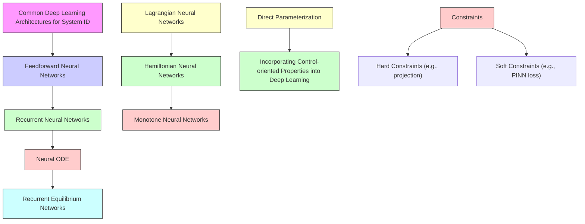

# 5. Deep Learning-based System Identification

Deep learning for system system identification is usually formulated as a supervised learning problem. Recall that in a system identification problem, we are given a dataset $\mathbf { \mathcal { W } } \mathbf { \Psi } =$ $\{ ( u _ { i , k } , y _ { i , k } ) \} _ { i }$ of input-output trajectories from a continuous-time , , ,dynamical system. We seek to learn a nonlinear state-space model with dynamics $f _ { \theta }$ and output model $h _ { \theta } .$ , where the model θ θparameters  is obtained from the unconstrained optimization θ(14) or the constrained system identification problem (21). For fitting of the deep learning based system ID models, discretely sampled data from the continuous-time system is often assumed. Some methods assume access to not only the inputoutput trajectories, but also the state trajectories thus $\begin{array} { r l } { \mathcal { W } ^ { + } } & { { } = } \end{array}$ $\{ ( x _ { i , k } , u _ { i , k } , y _ { i , k } ) \} _ { i }$ , which we will discuss in context. We will , , , , ,start with reviewing common model choices for system identification from classic deep learning architectures (e.g., feedforward neural networks, recurrent neural networks) to physicsinformed deep learning architectures (e.g., neural ordinary differential equations, recurrent equilibrium networks), and then surveying recent literature on incorporating control-relevant system properties into deep learning models.

flowchart

Figure 7: Overview of the deep learning architectures and control-oriented architectures for system identification.
