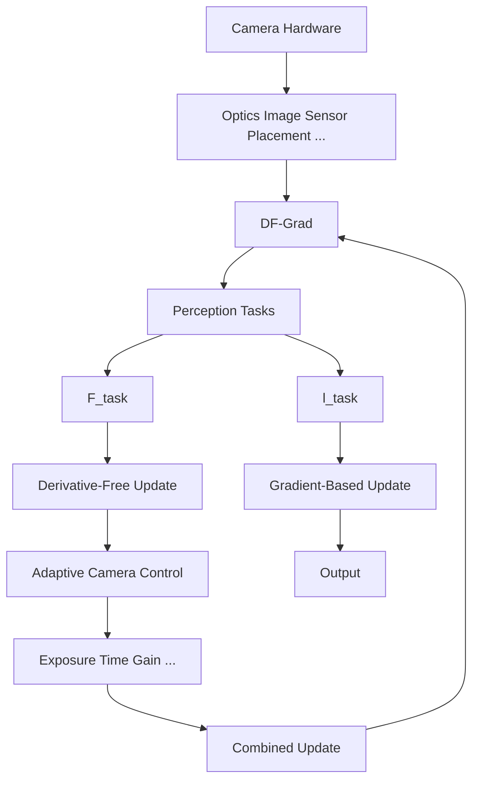

# 1. Introduction

Image quality directly determines the performance of downstream perception tasks. A well-designed camera hardware architecture preserves essential visual information, while adaptive imaging algorithms maintain quality under varying capture conditions. For example, an adaptive camera control (ACC) algorithm that dynamically ad-

flowchart

Figure 1. We introduce a novel end-to-end method that jointly optimises camera hardware parameters, adaptive camera control algorithms, and perception tasks to improve task performance. We combine a fitness function $F _ { \mathrm { t a s k } }$ for a derivative-free optimiser and a loss function $l _ { \mathrm { t a s k } }$ for a gradient-based optimiser using the proposed DF-Grad method to update neural network-based adaptive control algorithms, allowing them to learn from a nondifferentiable image formation process. The method supports optimisation of static camera parameters that are continuous and discrete, as well as dynamic camera parameters, enabling task-aware and adaptive camera design.

justs exposure can reduce degradation caused by illumination changes or motion.

Recent works have proposed task-driven ACC algorithms, particularly for auto-exposure (AE), that optimise exposure based on task performance. Tomasi et al. [46] trained an AE network for feature extraction, while Onzon et al. [36] jointly trained an AE network with an object detector. However, these methods assume fixed camera hardware and neglect the interaction between dynamic parameters and key image effects such as motion blur, which depends on exposure time and scene dynamics.
