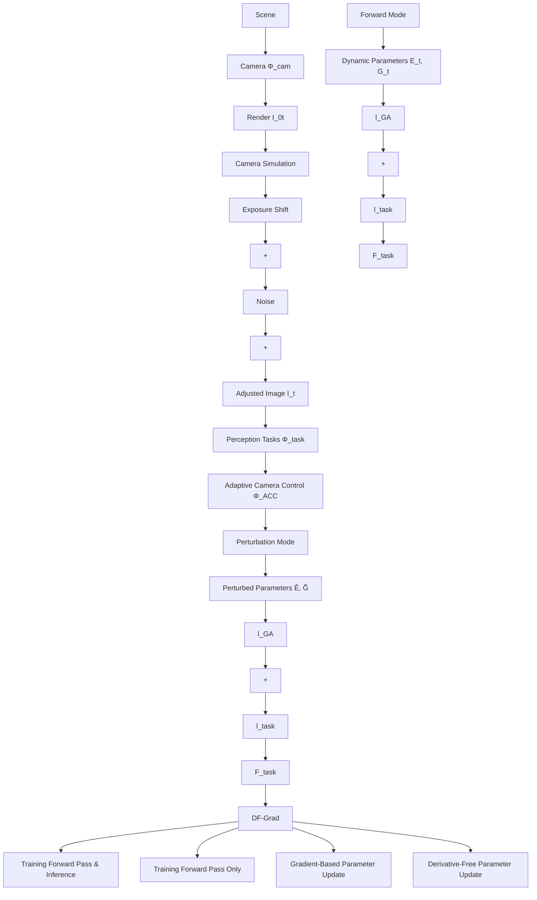

Task-Driven Adaptive Camera Control ACC algorithms are widely used to adapt cameras to dynamic conditions. Many works control dynamic parameters, especially those related to exposure and image signal processing, based on task performance, targeting applications such as feature extraction for visual odometry [16, 39, 46], object detection [42], localisation [4], and homography estimation [27]. Other approaches jointly train neural ACC algorithms with perception tasks in an end-to-end manner, yielding improved performance [36, 40, 56]. Our method further codesigns camera hardware, enabling tighter integration between hardware, ACC algorithms, and downstream tasks.

Moreover, existing ACC methods neglect effects induced by dynamic parameter changes. Using the proposed DF-Grad, the network learns connections between parameters and effects, even when rendered non-differentiably.

Hybrid Gradient-Based and Derivative-Free Optimisation Prior work has combined derivative-free and gradientbased optimisation in other contexts. ERL [22] and CERL [23] use evolutionary algorithms to generate policies for supervising gradient-trained agents. AutoAugment [10] applies evolutionary search to identify augmentation strategies that guide policy networks. To our knowledge, our method is the first to combine derivative-free and gradientbased optimisation for training ACC networks, enabling effective learning with non-differentiable image formation.

flowchart

