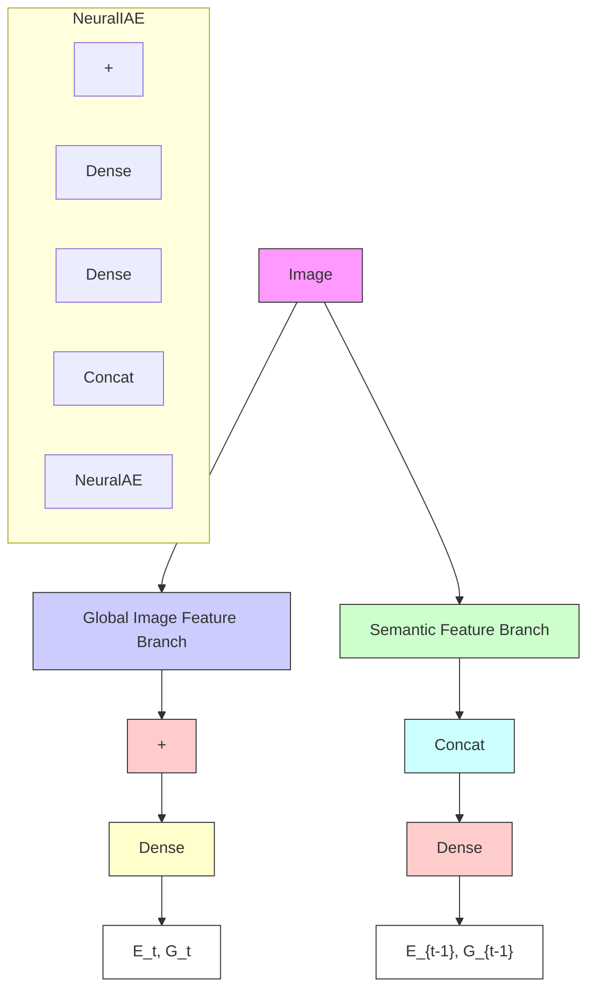

Multiplexed illumination for classifying visually similar objects.
Applied Optics, 60(10):B23–B31, 2021.
3, 5   
[52] Korbinian Weikl, Damien Schroeder, Daniel Blau, Zhenyi Liu, and Walter Stechele.
End-to-end imaging system optimization for computer vision in driving automation.
In Proceedings of IS&T Int’l.
Symp.
on Electronic Imaging: Autonomous Vehicles and Machines, 2021.
2   
[53] Chengyang Yan and Donald G.
Dansereau.
TaCOS: Taskspecific camera optimization with simulation.
In Proceedings of the Winter Conference on Applications of Computer Vision, pages 2052–2062, 2025.
2, 3, 4, 5, 6, 8, 12, 16

[54] Xinge Yang, Qiang Fu, Yunfeng Nie, and Wolfgang Heidrich. Image quality is not all you want: Task-driven lens design for image classification. arXiv preprint arXiv:2305.17185, 2023. 2   
[55] Xinge Yang, Qiang Fu, and Wolfgang Heidrich. Curriculum learning for ab initio deep learned refractive optics. Nature Communications, 15(1):6572, 2024. 2   
[56] Masakazu Yoshimura, Junji Otsuka, Atsushi Irie, and Takeshi Ohashi. DynamicISP: dynamically controlled image signal processor for image recognition. In Proceedings of the IEEE/CVF International Conference on Computer Vision, pages 12866–12876, 2023. 2   
[57] Yuxuan Zhang, Bo Dong, and Felix Heide. All you need is raw: Defending against adversarial attacks with camera image pipelines. In European Conference on Computer Vision, pages 323–343. Springer, 2022. 2

flowchart

Figure 4. Adaptive camera control algorithm. We adopt the architecture from NeuralAE [36] as the main architecture for the ACC algorithm. We modify NeuralAE by using a single camera instead of two cameras, and by concatenating features from the predicted dynamic parameters at the previous step to the extracted features in the semantic feature branch for temporal consistency. Finally, we allow it to predict both exposure time and gain, rather than a single exposure value as in its original version. Figure is adapted and modified from [36].
