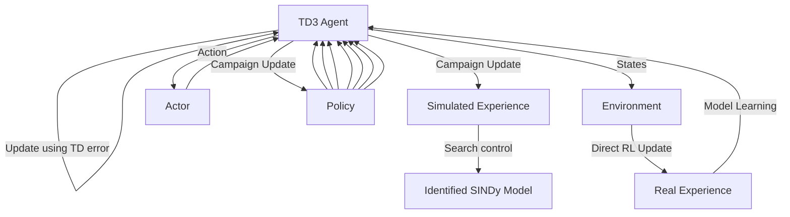

# 2 Dyna-Style SINDY-TD3 Framework

flowchart

Fig. 1: Dyna-Style SINDy-TD3 Reinforcement Learning Architecture

This section introduces the proposed Dyna-Style SINDy-TD3 framework which aims to achieve data-driven control for non-linear systems with limited data available. The framework depends mainly on the integration of the main components which are Sparse Identification of Nonlinear Dynamics (SINDy) and Twin Delayed Deep Deterministic Policy Gradient (TD3).

This framework conceptually follows a Dyna-Q reinforcement learning architecture [13]. The Dyna-Q architecture is a foundational reinforcement learning framework that combines between model-based and model-free techniques to enhance data efficiency and maintain learning flexibility. It depends on integrating three main components which are real-world interactions, model learning and planning. In Dyna-Q, an agent interacts with the environment to collect experience, which is used in two ways: directly to update the value function and policy using Q-Learning (direct reinforcement learning), and to build a model of the environment. This model is then used to generate simulated experience, which is treated as if it were real for further learning — a process known as planning.
