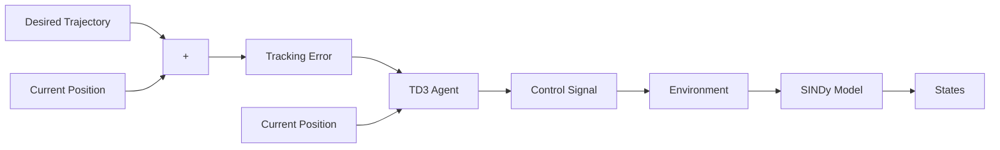

# 2.3 Reinforcement Learning Control (TD3)

The proposed control method which is used is Twin Delayed DDPG (TD3) algorithm [15]. TD3 is an actor-critic model-free off policy algorithm. Actor-critic methods involve calculating a parameterized policy that functions as an actor. The actor’s primary role is to determine the appropriate action based on the current state of the environment. Simultaneously, the method computes a value function that acts as a critic, assessing the actions selected by the actor. The critic also calculates the temporal difference (TD) error, which is used to update both the actor and the critic during the learning process. In TD3, it uses two critics instead of just one and take the lower value computed by both in order to reduce the overestimation bias commonly found in value based methods. Both the actor and critics are typically represented using Artificial Neural Networks (ANNs).

The reinforcement learning control presented in this paper is shown in Fig. 2. The framework is composed of several interconnected modules. The environment block represents the physical system under control and is responsible for generating data that reflects its true dynamics. A model learning block acquires this data to identify a simplified yet representative model of the system’s behavior, which can serve as a surrogate model for control policy training. This surrogate model is used to generate additional synthetic experiences added to the TD3 buffer to accelerate the learning process. Finally, the reinforcement learning agent block is trained using both real and synthetic data. The agent processes observations, including errors between desired and actual system outputs as well as other relevant state information, and produces control actions to drive the system toward its target behavior. This architecture allows for sample-efficient learning and improved performance in complex, nonlinear settings.

flowchart

Fig. 2: SINDy-TD3 control framework
