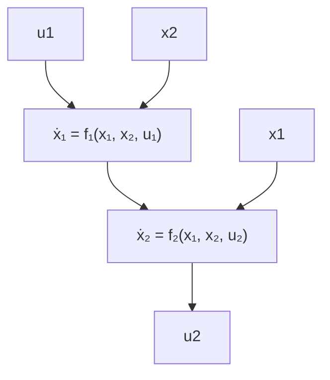

Definition 3: A locally Lipschitz continuous function V : $\mathbb { R } ^ { n } \to \mathbb { R } _ { \geq 0 }$ is said to be a FxTS Lyapunov function for (1) if 1) There exists $\underline { { \alpha } } , \overline { { \alpha } } \in \mathcal { K } _ { \infty }$ such that

$$\underline {{\alpha}} (| x |) \leq V (x) \leq \overline {{\alpha}} (| x |), \quad \forall x \in \mathbb {R} ^ {n}. \tag {3}$$

2) There exists $\Psi \in { \mathcal { K } } _ { \infty } ^ { \mathrm { F x T } }$ such that the following holds:

$$\dot {V} (x) \leq - \Psi (V (x)), \forall x \in \mathbb {R} ^ {n}. \tag {4}$$

Remark 1: In [4, Lemma 1], it was shown that the origin of (1) is FxTS if it admits a FxTS Lyapunov function. Moreover, since Ψ in (4) is given by $\Psi ( s ) = c _ { 1 } s ^ { p _ { 1 } } + c _ { 2 } s ^ { p _ { 2 } }$ with $c _ { 1 } , c _ { 2 } >$ $0 , p _ { 1 } \in ( 0 , 1 ) , p _ { 2 } \ > \ 1$ , the settling time of $\beta$ satisfies the following upper bound for all $x _ { 0 } \in \mathbb { R } ^ { n }$ :

$$T (x _ {0}) \leq \frac {1}{c _ {1} (1 - p _ {1})} + \frac {1}{c _ {2} (p _ {2} - 1)}.$$

Definition 4: A locally Lipschitz function $V : \mathbb { R } ^ { n } \to \mathbb { R } _ { > 0 }$ is said to be a FxT-ISS Lyapunov function for the system (1) if it satisfies item 1) of Definition 3 and there exists $\chi \in { \cal K } _ { \infty }$ and $\Psi \in { \mathcal { K } } _ { \infty } ^ { \mathrm { F x T } }$ such that the following holds:

$$V (x) \geq \chi (| u |) \quad \Longrightarrow \quad \dot {V} (x, u) \leq - \Psi (V (x)), \tag {5}$$

for all $x \in \mathbb { R } ^ { n }$ and $u \in \mathbb { R } ^ { m }$ .

It is shown in [28] that if (1) admits a FxT-ISS Lyapunov function, then it is FxT-ISS. Converse results can also be found in [29].

flowchart

Fig. 1: A block diagram depicting the interconnection (6).
