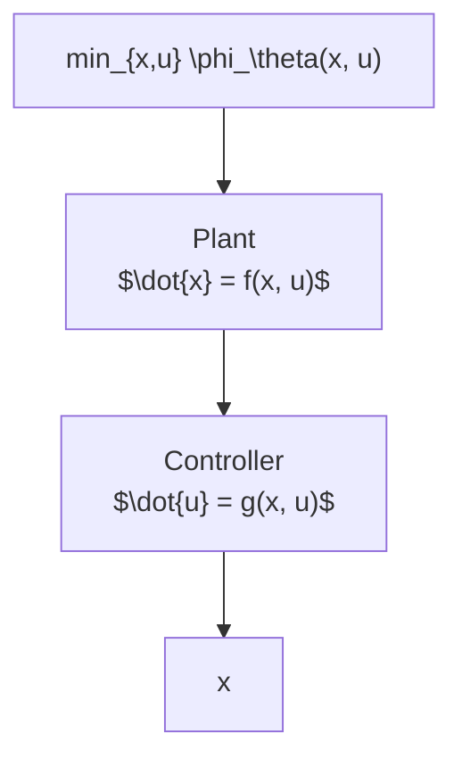

$$v = - \frac {w}{c} h (u) - \frac {2 | w |}{c} \left(\frac {x - h (u)}{| x - h (u) | ^ {\tilde {p}}} + \frac {x - h (u)}{| x - h (u) | ^ {\tilde {q}}}\right),$$

where h is ℓ-Lipschitz and $u \in \mathbb { R }$ is an external input, renders the system into a closed form that satisfies Assumption 3. Extensions to multi-variable settings can be done using results from the FxT control literature [4]. □

flowchart

Fig. 3: A block diagram depicting the feedback optimization scheme (29).

The primary goal is to design an update law on the input u that stabilizes (20), in a fixed-time, while ensuring that its trajectories converge to the solutions of following the timevarying optimization problem

$$\min _ {x, u} \phi_ {\theta} (x, u) \tag {24a}\text { subject to: } x = h (u), \tag {24b}$$

where the cost function $\phi _ { \theta } : \mathbb { R } ^ { n } \times \mathbb { R } ^ { N }  \mathbb { R }$ is $\mathcal { C } ^ { 1 }$ and depends on a time-varying parameter $\theta \in \mathbb { R } ^ { m }$ , that evolves according to the following exosystem:

$$\dot {\theta} = \varepsilon_ {0} \Pi (\theta), \quad \theta \in \Theta , \tag {25}$$

where $\varepsilon _ { 0 } > 0$ is a small parameter that controls the rate of change of θ. For the purpose of regularity, the set $\Theta \subset \mathbb { R } ^ { m }$ and mapping $\Pi : \mathbb { R } ^ { m }  \mathbb { R } ^ { m }$ satisfy the following assumption:

Assumption 4: The function Π(·) is Lipschitz continuous, and the set Θ is compact and forward invariant under the dynamics (25). □

By substituting (24b) into (24a), we arrive at the following unconstrained quasi-steady state optimization problem

$$\min _ {u} \Phi_ {\theta} (u), \tag {26}$$

where $\Phi _ { \theta } ( u ) : = \phi _ { \theta } ( h ( u ) , u )$ . To guarantee that (26) is welldefined and has a unique solution for each $\theta \in \mathbb { R } ^ { m }$ , we impose the following standard assumptions on the cost functions $\Phi _ { \theta } ( \cdot )$ [33], [40]:
