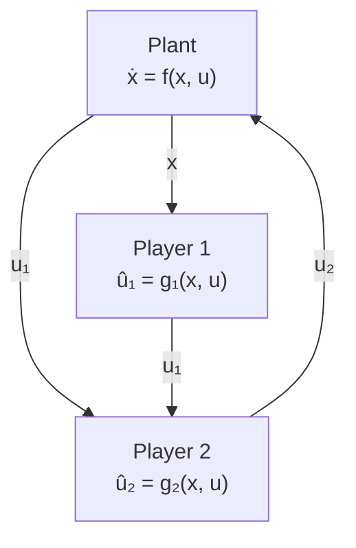

Fig. 5: A diagram depicting the interconnection (44) for a two player game with a plant in the loop.

To seek the Nash equilibrium of the quasi-steady state, we introduce a decoupled fixed-time pseudogradient flow on the players’ actions:

$$\dot {u} _ {i} = - \mathcal {F} _ {\xi} (\nabla_ {i} \mathcal {J} _ {i} (u)),$$

for some given $\xi _ { 1 } \in ( 0 , 1 )$ and $\xi _ { 2 } < 0$ , where $\nabla _ { i }$ denotes the partial derivative with respect to the i-th argument and $\mathcal { F } _ { \xi }$ is given in (27). It can be verified, via chain rule, that

$$
\begin{array}{l} \nabla_ {i} \mathcal {J} _ {i} (u) = [ H (u) ^ {\top} \nabla J _ {i} (h (u), u) ] _ {i} \\ = \left[ \begin{array}{c c} \partial h (u) ^ {\top} & e _ {i} ^ {\top} \end{array} \right] \nabla J _ {i} (h (u), u), \\ \end{array}
$$

where $H ( u )$ is given in (28), and $e _ { i }$ is the i-th standard basis vector of $\dot { \mathbb { R } } ^ { N }$ . By replacing the steady-state approximation $h ( u )$ with the measured value $x ,$ we obtain a real-time feedback control law on $u _ { i } \colon$

$$\dot {u} _ {i} = - \mathcal {F} _ {\xi} (\mathcal {G} _ {i} (x, u)), \tag {43}$$

where $\mathcal { G } _ { i }$ is given by

$$
\mathcal {G} _ {i} (x, u) = \left[ \begin{array}{c c} \frac {\partial h (u)}{\partial u _ {i}} ^ {\top} & e _ {i} ^ {\top} \end{array} \right] \nabla J _ {i} (x, u).
$$

We then obtain the following interconnected system:

$$\dot {x} = f (x, u) \tag {44a}\dot {u} _ {i} = - \mathcal {F} _ {\xi} (\mathcal {G} _ {i} (x, u)), \quad i = 1,..., N \tag {44b}$$

We now introduce the following operator

$$\mathcal {G} (x, u) = \left[ \mathcal {G} _ {1} (x, u),..., \mathcal {G} _ {N} (x, u) \right] ^ {\top}.$$

The function $\mathcal { G } ( x , u )$ can be seen as a feedback-based version of the pseudogradient operator that is found in traditional Nash equilibrium seeking algorithms [43], [44]. In fact, it follows directly by definition that $\mathcal { G } ( h ( u ) , u )$ is the pseudogradient (in the traditional sense) of the quasi-steady state game.

In this paper, we focus on a class of games termed potential games, which are characterized by the following assumption:

Assumption 8: There exists a $\mathcal { C } ^ { 1 }$ function $P : \mathbb { R } ^ { N } \to \mathbb { R } _ { > 0 }$ such that $\nabla P ( u ) = \mathcal { G } ( h ( u ) , u )$ for all $u \in \mathbb { R } ^ { N }$ . Moreover, the following holds:
