# 4.2 QITE Solver

After we map the binary ADMM block to the Hamiltonian in (45), the problem becomes the following: we want to find the ground quantum state of H, that is, the quantum state with the smallest energy. Each bitstring corresponds to one quantum basis state, and the energy of that quantum state is equal to the QUBO cost. If we can prepare the quantum ground state of H, we can read out a good binary solution by measuring it. Note that each time we talk about a state in this section is a quantum state and not a state of MAS. We can think of the energy of H as a landscape with many hills and valleys. The ground state is the bottom of the deepest valley.

The QITE algorithm is a way to slide down this landscape. In quantum mechanics, time evolution is usually defined with the Schr¨odinger equation. If we replace the real-time variable t with −iτ , where i is the imaginary unit, we obtain an imaginary-time equation. This imaginary-time evolution damps the high-energy components of the state while preserving the low-energy components. After some imaginary time, the state tends to align with the ground state of H.

```mermaid
graph TD
    q0[" q0 "] --> R0[" R0 (R0) "]
    q0 --> R2[" R2 (R2) "]
    q1[" q1 "] --> R1[" R1 (R1) "]
    q1 --> R2[" R2 (R2) "]
    q2[" q2 "] --> R3[" R3 (R3) "]
    q2 --> R2[" R2 (R2) "]
    q3[" q3 "] --> R4[" R4 (R4) "]
    q3 --> R2[" R2 (R2) "]
    R0 --> plus1[" + "]
    R2 --> plus2[" + "]
    R1 --> plus3[" + "]
    R3 --> plus4[" + "]
    R4 --> plus5[" + "]
    plus1 --> sum1[" sum1 "]
    plus2 --> sum2[" sum2 "]
    plus3 --> sum3[" sum3 "]
    plus4 --> sum4[" sum4 "]
    plus5 --> sum5[" sum5 "]
    plus6 --> sum6[" sum6 "]
    plus7 --> sum7[" sum7 "]
    plus8 --> sum8[" sum8 "]
    plus9 --> sum9[" sum9 "]
    plus10 --> sum10[" sum10 "]
    plus11 --> sum11[" sum11 "]
    plus12 --> sum12[" sum12 "]
    plus13 --> sum13[" sum13 "]
    plus14 --> sum14[" sum14 "]
    plus15 --> sum15[" sum15 "]
    plus16 --> sum16[" sum16 "]
    plus17 --> sum17[" sum17 "]
    plus18 --> sum18[" sum18 "]
    plus19 --> sum19[" sum19 "]
    plus20 --> sum20[" sum20 "]
    plus21 --> sum21[" sum21 "]
    plus22 --> sum22[" sum22 "]
    plus23 --> sum23[" sum23 "]
    plus24 --> sum24[" sum24 "]
    plus25 --> sum25[" sum25 "]
    plus26 --> sum26[" sum26 "]
    plus27 --> sum27[" sum27 "]
    plus28 --> sum28[" sum28 "]
    plus29 --> sum29[" sum29 "]
    plus30 --> sum30[" sum30 "]
```

flowchart

Fig. 2. Example of an ansatz circuit $U ( \theta )$ for QITE
