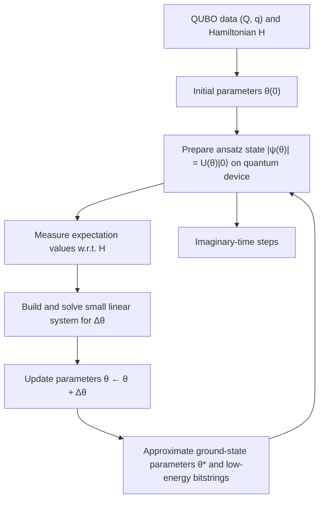

Fig. 3. Schematic view of the QITE procedure

direction, for example, $\theta  \theta + \Delta \theta$ . This procedure is then repeated for several steps. Each step is designed to decrease the energy expectation $ { \langle \psi ( \theta ) \vert } \hat { H }  { \vert \psi ( \theta ) \rangle }$ , so the parameters gradually move toward a region where the ansatz state has low energy.

After a finite number of imaginary-time steps, we obtain a parameter vector $\theta ^ { \star }$ for which the ansatz state $| \psi ( \theta ^ { \star } ) \rangle$ has low energy with respect to H. This state is an approximation of the ground quantum state of the QUBO Hamiltonian. To extract a binary topology from it, we measure $| \psi ( \theta ^ { \star } ) \rangle$ in the computational basis many times. Each measurement produces a bitstring $r \in \{ 0 , 1 \} ^ { m }$ , which encodes one candidate set of active edges. The probabilities of these bitstrings depend on the amplitudes of the quantum state. In our implementation, we collect the bitstrings with the highest empirical probabilities, evaluate their exact QUBO cost $z ^ { \dagger } Q z + { \dot { q } } ^ { \top } z$ on a classical computer, and select the bitstring with the lowest cost as the solution of the binary block for that ADMM iteration.

In the overall three-block ADMM algorithm, this QITEbased solver is used as a module that proposes a binary proxy vector r. At each ADMM iteration, the current QUBO is converted to a Hamiltonian, QITE is run for a limited number of imaginary-time steps, and a small set of candidate bitstrings is sampled and evaluated. If the new candidate improves the QUBO objective, it is accepted and used as the updated r; otherwise, the previous binary solution can be kept. In this way, the quantum routine explores the combinatorial space of communication topologies, while the ADMM framework maintains a clear structure and convergence properties for the full topology design algorithm.
