```mermaid
graph TD
    A["v"] --> B["1/(s+α)"]
    B --> C["u"]
    C --> D["P"]
    D --> E["e"]
    E --> F["s+α"]
    F --> G["Ψ_Δ"]
    G --> H["z_qp"]
    H --> I["Σ_{i=1}^N λ_i Ψ_{N7}"]
    I --> J["z_dz"]
    J --> K["Σ_{i=1}^N Λ_i Ψ_{N7}"]
    K --> L["v"]
    L --> M["1/(s+α)"]
    M --> N["ω"]
    N --> O["N(u)"]
    O --> P["1/(s+α)"]
    P --> Q["Ψ_Δ"]
    Q --> R["z_qp"]
    R --> S["Σ_{i=1}^N Λ_i Ψ_{N7}"]
    S --> T["z_dz"]
    T --> U["Σ_{i=1}^N Λ_i Ψ_{N7}"]
    U --> V["v"]
    V --> W["1/(s+α)"]
    W --> X["u"]
    X --> Y["d"]
    Y --> Z["P"]
    Z --> AA["e"]
    AA --> AB["s+α"]
    AB --> AC["Ψ_Δ"]
    AC --> AD["z_qp"]
    AD --> AE["Σ_{i=1}^N Λ_i Ψ_{N7}"]
    AE --> AF["z_dz"]
    AF --> AG["Σ_{i=1}^N Λ_i Ψ_{N7}"]
    AG --> AH["v"]
    AH --> AI["1/(s+α)"]
    AI --> AJ["u"]
    AJ --> AK["d"]
    AK --> AL["P"]
    AL --> AM["e"]
    AM --> AN["s+α"]
    AN --> AO["Ψ_Δ"]
    AO --> AP["z_qp"]
    AP --> AQ["Σ_{i=1}^N Λ_i Ψ_{N7}"]
    AQ --> AR["z_dz"]
    AR --> AS["Σ_{i=1}^N Λ_i Ψ_{N7}"]
    AS --> AT["v"]
    AT --> AU["1/(s+α)"]
    AU --> AV["u"]
    AV --> AW["d"]
    AW --> AX["P"]
    AX --> AY["e"]
    AY --> AZ["s+α"]
    AZ --> BA["Ψ_Δ"]
    BA --> BB["z_qp"]
    BB --> BC["Σ_{i=1}^N Λ_i Ψ_{N7}"]
    BC --> BD["z_dz"]
    BD --> BE["Σ_{i=1}^N Λ_i Ψ_{N7}"]
    BE --> BF["v"]
    BF --> BG["1/(s+α)"]
    BG --> BH["u"]
    BH --> BI["d"]
    BI --> BJ["P"]
    BJ --> BK["e"]
    BK --> BL["s+α"]
    BL --> BM["Ψ_Δ"]
    BM --> BN["z_qp"]
    BN --> BO["Σ_{i=1}^N Λ_i Ψ_{N7}"]
    BO --> BP["z_dz"]
    BP --> BQ["Σ_{i=1}^N Λ_i Ψ_{N7}"]
    BQ --> BR["v"]
    BR --> BS["1/(s+α)"]
    BS --> BT["u"]
    BT --> BU["d"]
    BU --> BV["P"]
    BV --> BW["e"]
    BW --> BX["s+α"]
    BX --> BY["Ψ_Δ"]
    BY --> BZ["z_qp"]
    BZ --> CA["Σ_{i=1}^N Λ_i Ψ_{N7}"]
    CA --> CB["z_dz"]
    CB --> CC["Σ_{i=1}^N Λ_i Ψ_{N7}"]
    CC --> CD["v"]
    CD --> CE["1/(s+α)"]
    CE --> CF["u"]
    CF --> CG["d"]
    CG --> CH["P"]
    CH --> CI["e"]
    CI --> CJ["s+α"]
    CJ --> CK["Ψ_Δ"]
```

Fig. 1. Transformed uncertain LFT system.

To ensure physical realizability, the factor (s+α) introduced by the loop transformation must be absorbed into the known plant dynamics, which motivates the following assumption.

Assumption 2: The nominal part of the LFT system (3) is strictly proper.
