where $e _ { \omega } ( t ) = \omega ^ { * } ( t ) - \omega ^ { e } ( t )$ is the velocity error.

```mermaid
graph TD
    A["ωm*"] --> B["×"]
    C["ids*"] --> D["×"]
    B --> E["Speed controller"]
    D --> F["×"]
    E --> G["PI"]
    F --> H["PI"]
    G --> I["d, q / α, β"]
    H --> J["vds*"]
    I --> K["vαs"]
    J --> L["vβs"]
    K --> M["PWM"]
    L --> M
    M --> N["3-phase inverter"]
    N --> O["VDC"]
    P["Angle estimation"] --> Q["iqs"]
    Q --> R["d, q / α, β"]
    R --> S["iαs"]
    S --> T["a, b, c"]
    T --> U["iβs"]
    U --> V["iα"]
    V --> W["iα"]
    W --> X["iα"]
    X --> Y["iα"]
    Y --> Z["iα"]
    Z --> AA["iα"]
    AA --> AB["iα"]
    AB --> AC["iα"]
    AC --> AD["iα"]
    AD --> AE["iα"]
    AE --> AF["iα"]
    AF --> AG["iα"]
    AG --> AH["iα"]
    AH --> AI["iα"]
    AI --> AJ["iα"]
    AJ --> AK["iα"]
    AK --> AL["iα"]
    AL --> AM["iα"]
    AM --> AN["iα"]
    AN --> AO["iα"]
    AO --> AP["iα"]
    AP --> AQ["iα"]
    AQ --> AR["iα"]
    AR --> AS["iα"]
    AS --> AT["iα"]
    AT --> AU["iα"]
    AU --> AV["iα"]
    AV --> AW["iα"]
    AW --> AX["iα"]
    AX --> AY["iα"]
    AY --> AZ["iα"]
    AZ --> BA["iα"]
    BA --> BB["iα"]
    BB --> BC["iα"]
    BC --> BD["iα"]
    BD --> BE["iα"]
    BE --> BF["iα"]
    BF --> BG["iα"]
    BG --> BH["iα"]
    BH --> BI["iα"]
    BI --> BJ["iα"]
    BJ --> BK["iα"]
    BK --> BL["iα"]
    BL --> BM["iα"]
    BM --> BN["iα"]
    BN --> BO["iα"]
    BO --> BP["iα"]
    BP --> BQ["iα"]
    BQ --> BR["iα"]
    BR --> BS["iα"]
    BS --> BT["iα"]
    BT --> BU["iα"]
    BU --> BV["iα"]
    BV --> BW["iα"]
    BW --> BX["iα"]
    BX --> BY["iα"]
```

flowchart

Figure 1: Diagram of the induction motor control.

The value $i _ { d q } ^ { * }$ must be transformed to $\alpha - \beta - x - y$ for stator current control, resulting in $i _ { \alpha } ^ { * } ( t ^ { \ j } = I ^ { * } \sin \omega _ { e } t , i _ { \beta } ^ { * } ( t ) = I ^ { * } \cos \omega _ { e } t , i _ { x } ^ { * } ( t ) = 0 , i _ { y } ^ { * } ( t ) = 0$ with $I ^ { * } = \| i _ { d q } ^ { * } \|$ .

α  e β  e x yThe FSMPC part is responsible for stator current tracking of $i _ { \alpha \beta x y } ^ { * } .$ dq For this, a model-based scheme is used where the control action is determined minimizing a cost function. The model provides the one-step ahead prediction as

$$\hat {i} _ {\alpha \beta x y} (k + 1) = \Phi (\omega) i _ {\alpha \beta x y} (k) + \Psi U (k). \tag {5}$$

In order to cope with the delay in computations a second prediction is used. This is obtained as $\hat { i } _ { \alpha \beta x y } ( k + 2 ) = \Phi ( \omega ) \hat { i } _ { \alpha \beta x y } ( k + 1 ) + \Psi U ( k + 1 )$ .
