# A. Microscopic model

We consider two populations of interacting agents, leaders and followers, evolving on the unit circle $\Omega = [ - \pi , \pi ]$ . The dynamics of $N ^ { L }$ leaders and $N ^ { F }$ followers are

$$\mathrm{d} x _ {i} ^ {L} (t) = \left[ u _ {i} (t) + h _ {i} (t, X ^ {L} (t)) \right] \mathrm{d} t, \quad i = 1, \dots , N ^ {L}, \tag {1a}\mathrm{d} x _ {i} ^ {F} (t) = \left[ \sum_ {j = 1} ^ {N ^ {L}} f \left(\left\{x _ {i} ^ {F} (t), x _ {j} ^ {L} (t) \right\} _ {\pi}\right) + g _ {i} \left(t, X ^ {F} (t)\right) \right] \mathrm{d} t+ \sqrt {2 D} \mathrm{d} W _ {i} (t), \quad i = 1, \dots , N ^ {F}, \tag {1b}$$

where $x _ { i } ^ { L } , x _ { i } ^ { F } \in \Omega$ are the states of the i-th leader and follower, $X ^ { L } \in \Omega ^ { \dot { N } _ { L } }$ and $X ^ { F } \in \Omega ^ { N _ { F } }$ are the stack vectors containing the states of all leaders and followers, $h _ { i } : \mathbb { R } \times \Omega ^ { N ^ { L } } \to \mathbb { I }$ and $g _ { i } : \mathbb { R } \times \Omega ^ { N ^ { F } }  \mathbb { R }$ are internal dynamics characterizing each population, $u _ { i } \in \mathbb { R }$ is the control input acting on leaders, and Wi is a standard Wiener process with diffusion coefficient D. The interaction kernel $f : \Omega \to { \mathbb { R } }$ is the odd kernel [13]

```mermaid
graph LR
    A["\tilde{p}^F"] --> B((+))
    B --> C["e^F"]
    C --> D["Followers control"]
    D --> E["\tilde{p}^L"]
    E --> F["(+)"]
    F --> G["Leaders' controller"]
    G --> H["u(x,t)"]
    H --> I["Macro-to-micro bridge"]
    I --> J["u_i"]
    J --> K["Multi-agent dynamics"]
    K --> L["x_i"]
    L --> M["Micro-to-macro bridge"]
    M --> N["\rho^F"]
    N --> O["\rho^L"]
    O --> P["-"]
    P --> Q["\rho^F"]
    Q --> B
```

flowchart

