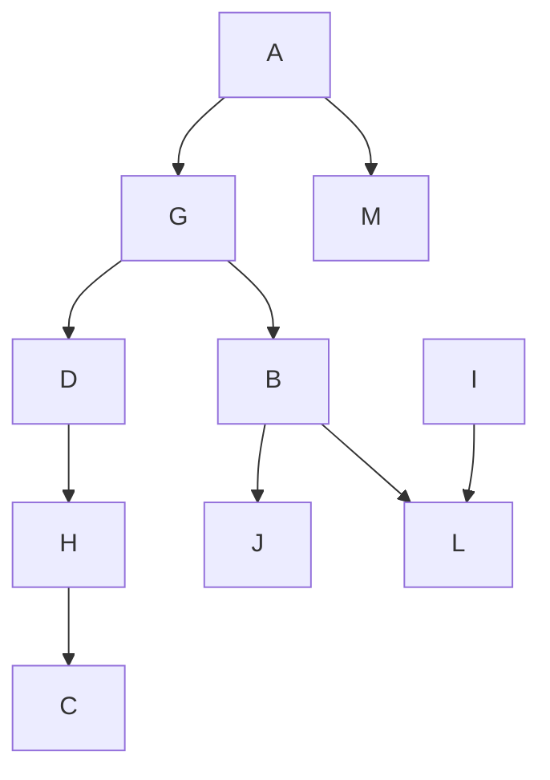
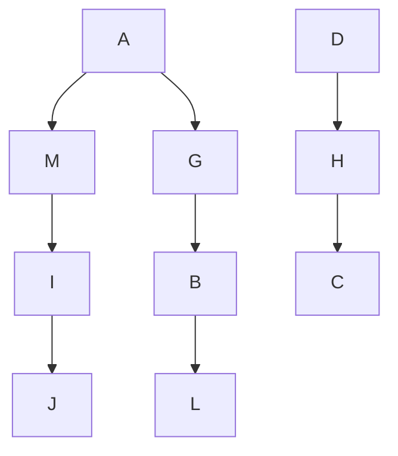

# KINEMATICS MODEL OF PIGEON FLIGHT

For simplicity and brevity, we model the kinematics of a pigeon flight in a similar way to an unmanned aerial vehicle (UAV) as in Shen et al [29]. Let the motion of the bird be as shown in Fig. 1. Ti, $D _ { i }$ and $L _ { i }$ are respectively the thrust, drag and the lift on the considered $i ^ { \mathrm { t h } }$ pigeon in a flock of multiple pigeons. $v _ { i }$ is the ground velocity of the $i ^ { \mathrm { t h } }$ pigeon. $\alpha _ { i } , \beta _ { i }$ and γi are respectively the banking, the heading and the flight path angles of the ith $i ^ { \mathrm { { t h } } }$ pigeon. Similar to the model in Shen et al [29], we let $\begin{array} { r } { \eta _ { x } = \frac { T _ { i } - D i } { m g } } \end{array}$ and $\begin{array} { r } { \eta _ { f } = \frac { L _ { i } } { m g } } \end{array}$ Li , where m is the mass of the pigeon and $g$ is the acceleration due to gravity. In these equations, $x _ { i } , y _ { i }$ and $z _ { i }$ are the positions of the $i ^ { \mathrm { { t h } } }$ pigeon in x, y and z axis, respectively, while $v _ { i }$ indicates the resultant velocity vector. The kinematics model [29] of the considered pigeon is:

$$
\left\{ \begin{array}{l} \dot {x} _ {i} = v _ {i} \cos \gamma_ {i} \cos \beta_ {i}, \\ \dot {y} _ {i} = v _ {i} \cos \gamma_ {i} \sin \beta_ {i}, \\ \dot {z} _ {i} = v _ {i} \sin \gamma_ {i}, \\ \dot {v} _ {i} = g (\eta_ {x} - \sin \gamma_ {i}), \\ \dot {\gamma} _ {i} = \frac {g}{v _ {i}} (\eta_ {f} \cos \alpha_ {i} - \cos \gamma_ {i}), \\ \dot {\beta} _ {i} = \frac {g}{v _ {i} \cos \gamma_ {i}} \eta_ {f} \sin \alpha_ {i}, \end{array} \right. \tag {1}
$$

For the sake of simplicity, we use a linearised double integrator model [29], [25].

$$
\left\{ \begin{array}{l} \ddot {x} _ {i} = a _ {x _ {i}}, \\ \ddot {y} _ {i} = a _ {y _ {i}}, \\ \ddot {z} _ {i} = a _ {z _ {i}}, \end{array} \right. \tag {2}
$$

where $a _ { x i } , ~ a _ { y i }$ and $a _ { z i }$ are the acceleration along x, y and z directions of the $i ^ { \mathrm { t h } }$ pigeon, whose kinematics is considered in Fig. 1.

flowchart

Fig. 2. Hierarchy of the pigeons in the flock

flowchart

Fig. 3. Leader-follower pairs in the flock of pigeons indicated by dotted circular contours
