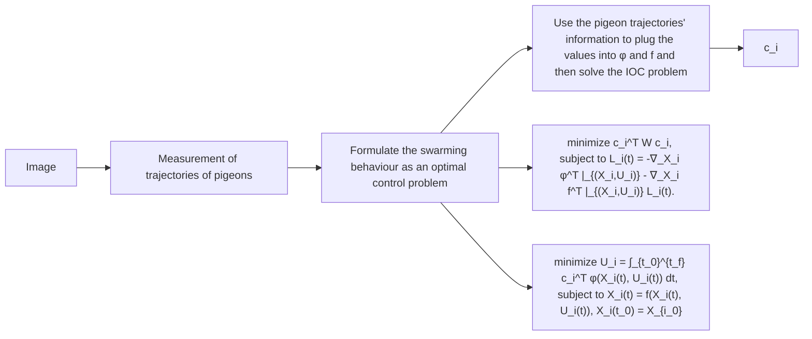

Problem Statement 4: Given the system dynamics $\begin{array} { r c l } { \dot { X } _ { i _ { i } } ( t ) } & { = } & { f ( X _ { i _ { i } } ( t ) , U _ { i _ { i } } ( t ) ) } \end{array}$ for a follower pigeon $\textit { i } \in$ $\{ \check { M } , G , B , D , H , \check { L } , I , C , \check { J } \}$ for a flight number $j ,$ the basis function vector $\phi ( X _ { i _ { j } } ( t ) , U _ { i _ { j } } ( t ) )$ , and trajectory measurements $X _ { i _ { j } } ( t )$ and control signal $U _ { i _ { j } } ( t ) , \ \forall t _ { 0 } \ \leq \ t \ \leq \ t _ { f } ,$ which are measured from the primary optimal control problem (32), the inverse trajectory tracking optimal control problem is to find the weight vector $c _ { i }$ for each follower pigeon $i \in \{ M , G , B , D , H , L , I , C , J \}$ .

Assumption 7 holds for the IOC problem using multiple flight trajectories. The Hamiltonian function [40] for (33) is:

$$
\begin{array}{l} \mathcal {H} (X _ {i _ {j}} (t), U _ {i _ {j}} (t), p _ {i _ {j}} (t)) = c _ {i} ^ {T} \phi (X _ {i _ {j}} (t), U _ {i _ {j}} (t)) \\ + p _ {i _ {j}} ^ {T} (t) f (X _ {i _ {j}} (t), U _ {i _ {j}} (t)), \tag {37} \\ \end{array}
$$

Hence, we determine the cost function now based on multiple flight data for each leader-follower pair. The necessary conditions of optimality for a flight number $j$ of a follower pigeon i are given a [19], [40]:

$$\dot {p} _ {i _ {j}} ^ {T} (t) + c _ {i} ^ {T} \nabla_ {X _ {i}} \phi | _ {\left(X _ {i _ {j}}, U _ {i _ {j}}\right)} + p _ {i _ {j}} ^ {T} (t) \nabla_ {X _ {i _ {j}}} f | _ {\left(X _ {i _ {j}}, U _ {i _ {j}}\right)} = \mathbf {0}, \tag {38}c _ {i} ^ {T} \nabla_ {U _ {i}} \phi | _ {\left(X _ {i j}, U _ {i j}\right)} + p _ {i j} ^ {T} (t) \nabla_ {U _ {i}} f | _ {\left(X _ {i j}, U _ {i j}\right)} = \mathbf {0}. \tag {39}$$

flowchart

