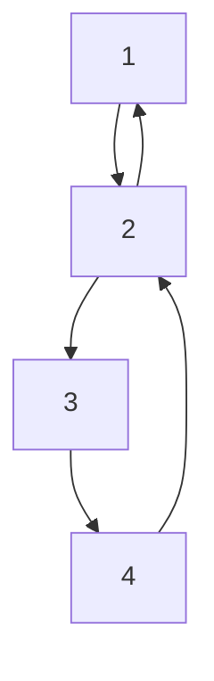
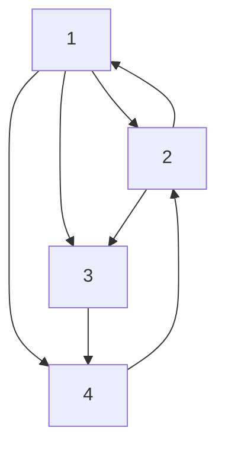

# 5.1 Pining control in opinion dynamics with a budget

Opinion dynamics typically involves nonlinearities in the form of “S-shaped” functions, such as the hyperbolic tangent and sigmoid (see, e.g., Ancona et al. (2023); Fontan and Zhang (2025)). Here, we consider a nonlinear discrete-time opinion dynamics

$$x _ {t + 1} = a \tanh \left((\alpha^ {*} I + \tilde {A} ^ {*}) x _ {t} + B ^ {*} u _ {t}\right) + w _ {t + 1}, \quad (3 3)$$

where $x _ { t } = [ x _ { 1 , t } , \cdot \cdot \cdot , x _ { n , t } ] \in \mathbb { R } ^ { n }$ denotes the opinion state of n agents at time t. The constant $a > 0$ is the maximum sensitivity of agents, $\alpha ^ { * } > 0$ determines the extent to which each agent reinforces its own opinion, and $\tilde { A } ^ { * } \in \mathbb { R } ^ { n \times n }$ is the adjacency matrix of an interaction graph $\mathcal { G }$ without self-loops. The noise sequence $\{ w _ { t } \}$ is i.i.d. with sup $ _ t \| w _ { t } \| < \bar { w }$ and $\mathbb { E } [ w _ { t } w _ { t } ^ { \top } ] > \sigma I _ { n }$ for some constants $\bar { w } > 0$ and $\sigma > 0$ . One way to intervening in the asymptotic behavior of the above opinion dynamics is through pinning control $u _ { t }$ , whereby a selected subset of nodes is influenced by an external leader whose opinion remains constant over time. Given a budget $M \in \mathbb { Z } ^ { + }$ , let $D \subset \{ 1 , 2 , \cdots , n \}$ with $| \mathcal { D } | = M$ denote the set of pinned nodes. The pinning vector is defined as $B ^ { * } = [ \bar { b } _ { 1 } , b _ { 2 } , \cdot \cdot \cdot , b _ { n } ] ^ { \top } \in \bar { \mathbb { R } ^ { n } }$ , where $b _ { i } = I ( i \in D )$ . Assume $\alpha ^ { * } a > 1$ , so that the decoupled single-agent dynamics $x _ { t + 1 } = a \operatorname { t a n h } ( \alpha ^ { * } x _ { t } )$ admits two nonzero equilibria. The desired leader opinion $x _ { L } \in \mathbb { R }$ is chosen as one of these equilibria.

flowchart

(a)

flowchart

(b)   
Fig. 1. Topology of the four agents. Yellow and green represent different initial opinions of the agents; the red node denotes the leader (external controller), and the red arrow indicates the pinning input applied to agent 1.
