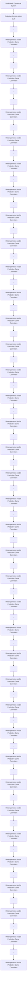

```mermaid
graph TD
    A["Real World Dynamical System"] --> B["Collective Control Action (u_t)"]
    B --> C["..."]
    C --> D["Heterogeneous Model Predictive Game Controllers"]
    D --> E["..."]
    E --> F["..."]
    F --> G["Heterogeneous Model Predictive Game Controllers"]
    G --> H["..."]
    H --> I["..."]
    I --> J["Heterogeneous Model Predictive Game Controllers"]
    J --> K["..."]
    K --> L["Heterogeneous Model Predictive Game Controllers"]
    L --> M["..."]
    M --> N["Heterogeneous Model Predictive Game Controllers"]
    N --> O["..."]
    O --> P["Heterogeneous Model Predictive Game Controllers"]
    P --> Q["..."]
    Q --> R["Heterogeneous Model Predictive Game Controllers"]
    R --> S["..."]
    S --> T["Heterogeneous Model Predictive Game Controllers"]
    T --> U["..."]
    U --> V["Heterogeneous Model Predictive Game Controllers"]
    V --> W["..."]
    W --> X["Heterogeneous Model Predictive Game Controllers"]
    X --> Y["..."]
    Y --> Z["Heterogeneous Model Predictive Game Controllers"]
    Z --> AA["..."]
    AA --> AB["Heterogeneous Model Predictive Game Controllers"]
    AB --> AC["..."]
    AC --> AD["Heterogeneous Model Predictive Game Controllers"]
    AD --> AE["..."]
    AE --> AF["Heterogeneous Model Predictive Game Controllers"]
    AF --> AG["..."]
    AG --> AH["Heterogeneous Model Predictive Game Controllers"]
    AH --> AI["..."]
    AI --> AJ["Heterogeneous Model Predictive Game Controllers"]
    AJ --> AK["..."]
    AK --> AL["Heterogeneous Model Predictive Game Controllers"]
    AL --> AM["..."]
    AM --> AN["Heterogeneous Model Predictive Game Controllers"]
    AN --> AO["..."]
    AO --> AP["Heterogeneous Model Predictive Game Controllers"]
    AP --> AQ["..."]
    AQ --> AR["Heterogeneous Model Predictive Game Controllers"]
    AR --> AS["..."]
    AS --> AT["Heterogeneous Model Predictive Game Controllers"]
    AT --> AU["..."]
    AU --> AV["Heterogeneous Model Predictive Game Controllers"]
    AV --> AW["..."]
    AW --> AX["Heterogeneous Model Predictive Game Controllers"]
    AX --> AY["..."]
    AY --> AZ["Heterogeneous Model Predictive Game Controllers"]
    AZ --> BA["..."]
    BA --> BB["Heterogeneous Model Predictive Game Controllers"]
    BB --> BC["..."]
    BC --> BD["Heterogeneous Model Predictive Game Controllers"]
    BD --> BE["..."]
    BE --> BF["Heterogeneous Model Predictive Game Controllers"]
    BF --> BG["..."]
    BG --> BH["Heterogeneous Model Predictive Game Controllers"]
    BH --> BI["..."]
    BI --> BJ["Heterogeneous Model Predictive Game Controllers"]
    BJ --> BK["..."]
    BK --> BL["Heterogeneous Model Predictive Game Controllers"]
    BL --> BM["..."]
    BM --> BN["Heterogeneous Model Predictive Game Controllers"]
    BN --> BO["..."]
    BO --> BP["Heterogeneous Model Predictive Game Controllers"]
    BP --> BQ["..."]
    BQ --> BR["Heterogeneous Model Predictive Game Controllers"]
    BR --> BS["..."]
    BS --> BT["Heterogeneous Model Predictive Game Controllers"]
    BT --> BU["..."]
    BU --> BV["Heterogeneous Model Predictive Game Controllers"]
    BV --> BW["..."]
    BW --> BX["Heterogeneous Model Predictive Game Controllers"]
```

