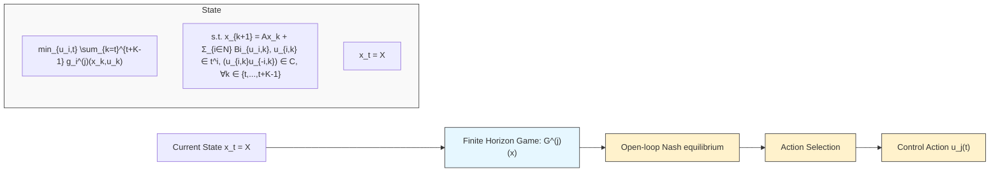

Recent work studied this form of misspecification and introduced the Game2Real gap, $( J _ { i } ^ { ( i ) } ( u ^ { \circ } ) - \bar { J } _ { i } ^ { ( i ) } ( u ^ { ( i ) } ) )$ , or the gap in predicted and realized performance caused by game model misspecification. Another line of research on inverse learning in games seeks to reduce this gap by estimating the objectives of other agents through online interactions [18], [19], [11], but either by approximation, insufficient data in estimation, or the need to design offline rather than adapt online, some level of misspecification between the conjectured game model and realized behavior will persist. This work seeks to understand how game model misspecifications affect the dynamics and equilibria of multi-agent systems.

flowchart

Fig. 2: Block Diagram of MPG Controller utilized by player j. At time step t, and system state $x _ { t }$ , player j solves for the vGNE $u ^ { ( j ) }$ of the finite horizon game $G ^ { ( j ) } ( x _ { t } )$ defined in (5). The controller then selects the first time step of their own control signal within the Nash solution, $u _ { j , t } ^ { ( j ) }$ , and deploys it within the system.

Specifically, we will focus on the class of model predictive game controllers, which embed game models within their feedback rules, and investigate the consequences of objective misspecification on the closed-loop dynamics.
