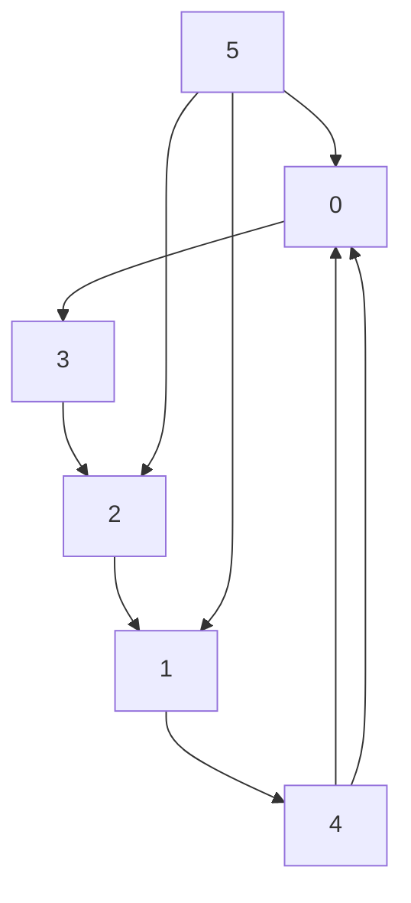

# IV. A SIMULATION EXAMPLE

Consider a MAS composed of an exosystem and five agents, with its corresponding communication graph illustrated in Figure 1. The adjacency weights are set to $a _ { i j } = 1 \operatorname { i f } \left( j , i \right) \in \mathcal { E } .$ , and $a _ { i j } = 0$ otherwise. One can observe that Assumption 2 is satisfied. Agent i is modeled as an inverted pendulum on a cart [9]. The linearized model of agent i is given by (2), where

$$
A _ {i} = \left[ \begin{array}{c c c c} 0 & 1 & 0 & 0 \\ 0 & 0 & g & 0 \\ 0 & 0 & 0 & 1 \\ 0 & \frac {f _ {i}}{l _ {i} M _ {1 i}} & \frac {(M _ {1 i} + M _ {2 i}) g}{l _ {i} M _ {1 i}} & - \frac {f _ {i}}{M _ {1 i}} \end{array} \right], B _ {i} = \left[ \begin{array}{c} 0 \\ 0 \\ 0 \\ \frac {1}{l _ {i} M _ {1 i}} \end{array} \right],

E _ {i} = \left[ \begin{array}{c c} 0 & 0 \\ \frac {\chi_ {i 1} + \chi_ {i 2}}{M _ {1 i}} & 0 \\ 0 & 0 \\ \frac {\chi_ {i 2}}{l _ {i} M _ {1 i}} & 0 \end{array} \right], C _ {i} = \left[ \begin{array}{c c c c} 1 & 0 & - l _ {i} & 0 \end{array} \right], F _ {i} = \left[ \begin{array}{c c} 1 & 2 \end{array} \right].
$$

Table I presents the parameters of the agents. The system matrix of exosystem (3) is given as $S = \left[ \begin{array} { l l } { 0 } & { - 0 . 2 } \\ { 0 . 2 } & { 0 } \end{array} \right]$ One can verify that Assumption 3 is satisfied.

Table I: The parameters of the ith agent.

<table><tr><td>Parameters</td><td>Meaning</td></tr><tr><td> $M_{1i} = 2 \cdot i$  kg</td><td>Mass of cart</td></tr><tr><td> $M_{2i} = 0.5 \cdot i$  kg</td><td>Mass of pendulum</td></tr><tr><td> $l_i = 1 \cdot i$  m</td><td>Length of pendulum</td></tr><tr><td> $g = 9.8 \text{ m/s}^2$ </td><td>Gravitational acceleration</td></tr><tr><td> $f_i = 0.2$ </td><td>Friction coefficient</td></tr><tr><td> $\chi_{i1} = 0.3 \cdot i, \chi_{i2} = 0.5 \cdot i$ </td><td>Coefficients related to the disturbance</td></tr></table>

flowchart

Figure 1: Communication graph ${ \mathcal { G } } .$
