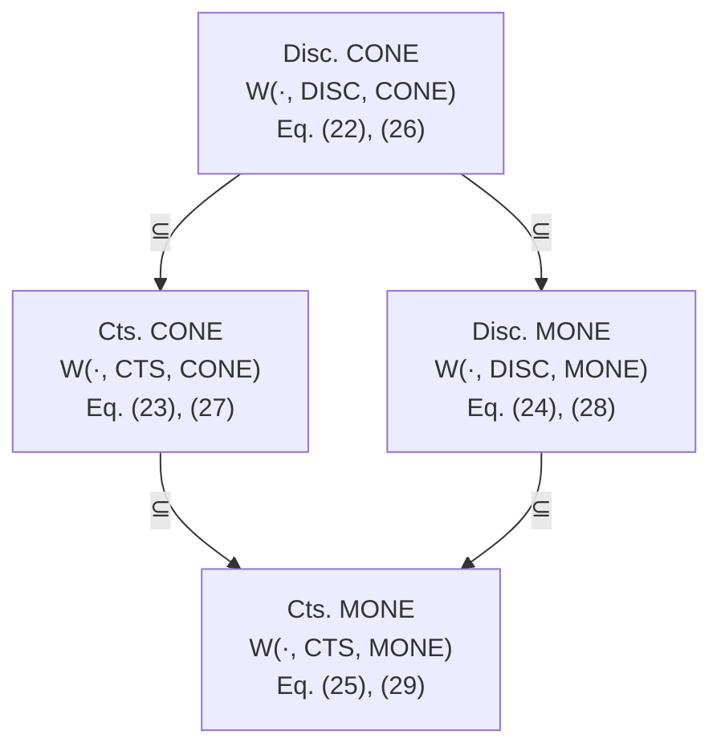

# A. Structural relationships of contractivity conditions

First we show that the discrete-time CONE certificates for both network architectures are reducible to Schur diagonal stability, generalizing prior results on firing-rate models [11].

Lemma 13 (Schur diagonal stability): $W \in \mathbb { R } ^ { n \times n }$ satisfies the discrete-time CONE certificates (22) and (26) if and only if W is Schur diagonally stable.

Proof: Note that $( 2 2 ) \iff P \preceq Q$ and $W ^ { \top } Q W \preceq \rho ^ { 2 } P$ . Similarly, (26) $\iff Q \ \preceq \ \rho ^ { 2 } P$ and $W ^ { \top } P W \preceq Q .$ . Hence, if (22) holds, then $W ^ { \top } Q W - Q \preceq \rho ^ { 2 } P - Q \preceq ( \rho ^ { 2 } - 1 ) Q \prec$ 0, so W is diagonally Schur stable with diagonal matrix Q. Analogously, (26) entails diagonal Schur stability, since that $W ^ { \top } { \tilde { Q W } } - Q \preceq \rho ^ { 2 } W ^ { \top } P W - Q \leq ( \rho ^ { 2 } - 1 ) Q \prec 0 ,$ .

Conversely, let $W ^ { \top } Q W - Q \prec 0$ for some diagonal matrix $Q \succ 0$ . Then $\exists ~ \rho \in ( 0 , 1 )$ such that $W ^ { \top } Q W \bar { \mathrm { ~ - ~ } } \rho ^ { 2 } Q \preceq 0$ . Then, $P = Q$ satisfies (22) and $P = \rho ^ { - 2 } Q$ satisfies (26).

Next, we establish the relationships between the various certificates in Table I.

flowchart

Fig. 1. A summary of relationships for the contractivity conditions from Table I. The sets $\dot { \boldsymbol { w } } ( \cdot , \cdot , \cdot )$ are described in Theorem 14. The discrete time CONE condition restricts the weight matrices the most, whereas the continuous time MONE condition enables maximum expressivity.

Theorem 14 (Reductions and duality of the certificates): Let $\mathcal { W } ( \mathcal { M } , \mathcal { T } , \mathcal { N } )$ denote the set of synaptic matrices W satisfying the contraction certificates in Table I for model $\mathcal { M } \ \in \ \{ \mathrm { F R } , \mathrm { H o p } \}$ , time domain $\mathcal { T } ~ \in ~ \{ \mathrm { C T S } , \mathrm { D I S C } \}$ , and nonlinearity class $\mathcal { N } \in \{ \mathrm { C O N E } , \mathrm { M O N E } \}$ . The following hold:
