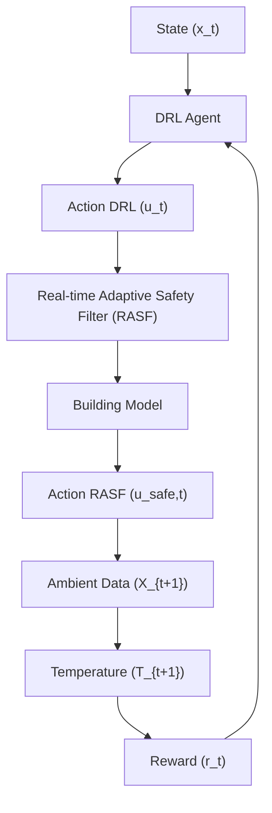

# 2.2 Control Architecture

The controller optimizes heat pump operation to ensure energy efficiency under varying ambient and operational conditions. To this end, we propose a model-free DRL control architecture combined with a safety filter to ensure compliance with energy flexibility constraints. The overall design is shown in Fig. 1.

flowchart

Fig. 1. Overview of the proposed safe DRL-based control scheme for space heating and demand-side flexibility.

The DRL controller is the primary decision-making instance, computing optimal control action $u _ { t }$ based on the current state of the system x. By interacting with the environment, the DRL controller learns an optimal policy, maximizing the reward function to take an action $u _ { t }$ based on the state x and reward r at the previous time step. The agent interacts with the building model, which uses a hybrid thermal model of a room to simulate the temperature at the next time step $t + 1$ based on the previous temperature and ambient data at timestep t. Detailed mathematical description of the framework is provided in Section 3.

Although we consider the flexibility provision in the state and in the reward function of the DRL controller, there is no guarantee that the energy flexibility requests are fulfilled at all times. Therefore, an additional safety measure is needed to fulfill the flexibility constraints at all times and thus ensure efficient operation of the grid. The Real-time Adaptive Safety Filter (RASF), introduced in Section 4, is the critical component that guarantees all actions applied to the environment comply with the predefined flexibility constraints outlined in the flexibility provision message by adjusting the proposed DRL action $u _ { t }$ to a safe control input $u _ { \mathrm { s a f e } , t }$ .
