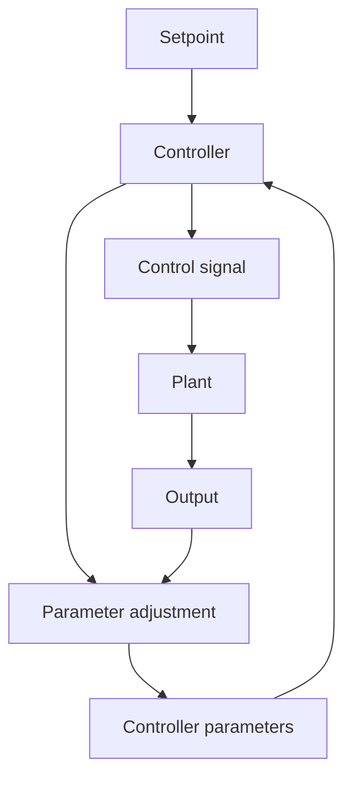

# 1.1 INTRODUCTION

In everyday language, “to adapt” means to change a behavior to conform to new circumstances. Intuitively, an adaptive controller is thus a controller that can modify its behavior in response to changes in the dynamics of the process and the character of the disturbances. Since ordinary feedback also attempts to reduce the effects of disturbances and plant uncertainty, the question of the difference between feedback control and adaptive control immediately arises. Over the years there have been many attempts to define adaptive control formally. At an early symposium in 1961 a long discussion ended with the following suggestion: “An adaptive system is any physical system that has been designed with an adaptive viewpoint.” A renewed attempt was made by an IEEE committee in 1973. It proposed a new vocabulary based on notions like self-organizing control (SOC) system, parameter-adaptive SOC, performance-adaptive SOC, and learning control system. However, these efforts were not widely accepted. A meaningful definition of adaptive control, which would make it possible to look at a controller hardware and software and decide whether or not it is adaptive, is still lacking. However, there appears to be a consensus that a constant-gain feedback system is not an adaptive system.

In this book we take the pragmatic attitude that an adaptive controller is a controller with adjustable parameters and a mechanism for adjusting the parameters. The controller becomes nonlinear because of the parameter adjustment mechanism. It has, however, a very special structure. Since general nonlinear systems are difficult to deal with, it makes sense to consider special classes of nonlinear systems. An adaptive control system can be thought of as having two loops. One loop is a normal feedback with the process and the controller. The other loop is the parameter adjustment loop. A block diagram of an adaptive system is shown in Fig. 1.1. The parameter adjustment loop is often slower than the normal feedback loop.

flowchart

Figure 1.1 Block diagram of an adaptive system.

A control engineer should know about adaptive systems because they have useful properties, which can be profitably used to design control systems with improved performance and functionality.
