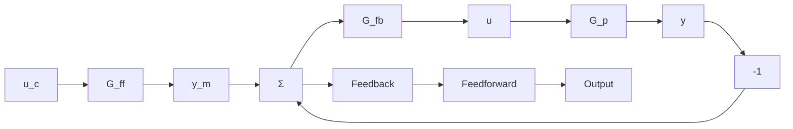

# Robust High-Gain Control

A linear feedback controller can be represented by the block diagram in Fig. 1.3. The feedback transfer function $G_{fb}$ is typically chosen so that disturbances acting on the process are attenuated and the closed-loop system is insensitive to process variations. The feedforward transfer function $G_{ff}$ is then chosen to give the desired response to command signals. The system is called a two-degree-of-freedom system because the controller has two transfer functions that can be chosen independently. The fact that linear feedback can cope with significant variations in process dynamics can be seen from the following intuitive argument. Consider the system in Fig. 1.3. The transfer function from $y_m$ to $y$ is

$$T = \frac {G _ {p} G _ {f b}}{1 + G _ {p} G _ {f b}}$$

Taking derivatives with respect to $G_{p}$ , we get

$$\frac {d T}{T} = \frac {1}{1 + G _ {p} G _ {f b}} \frac {d G _ {p}}{G _ {p}}$$

The closed-loop transfer function $T$ is thus insensitive to variations in the process transfer function for those frequencies at which the loop transfer function

$$L = G _ {p} G _ {f b} \tag {1.1}$$

is large. To design a robust controller, it is thus attempted to find $G_{fb}$ such that the loop transfer function is large for those frequencies at which there are large variations in the process transfer function. For those frequencies where $L(i\omega) \approx 1$ , however, it is necessary that the variations be moderate for the system to have sufficient robustness properties.

flowchart

Figure 1.3 Block diagram of a robust high-gain system.
