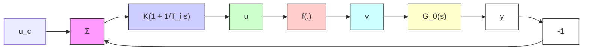

# EXAMPLE 1.4 Nonlinear valve

A simple feedback loop with a Proportional and Integrating (PI) controller, a nonlinear valve, and a process is shown in Fig. 1.8. Let the static valve characteristic be

$$v = f (u) = u ^ {4} \quad u \geq 0$$

Linearizing the system around a steady-state operating point shows that the incremental gain of the valve is $f'(u)$ , and hence the loop gain is proportional to $f'(u)$ . The system can perform well at one operating level and poorly at another. This is illustrated by the step responses in Fig. 1.9. The controller is tuned to give a good response at low values of the operating level. For higher values of the operating level the closed-loop system even becomes unstable. One way to handle this type of problem is to feed the control signal u through an inverse of the nonlinearity of the valve. It is often sufficient to use a fairly crude approximation (see Example 9.1). This can be interpreted as a special case of gain scheduling, which is treated in detail in Chapter 9.

flowchart

Figure 1.8 Block diagram of a flow control loop with a PI controller and a nonlinear valve.

  
Figure 1.9 Step responses for PI control of the simple flow loop in Example 1.4 at different operating levels. The parameters of the PI controller are K = 0.15, $T_{i} = 1$ . The process characteristics are $f(u) = u^{4}$ and $G_{0}(s) = 1/(s + 1)^{3}$ .
