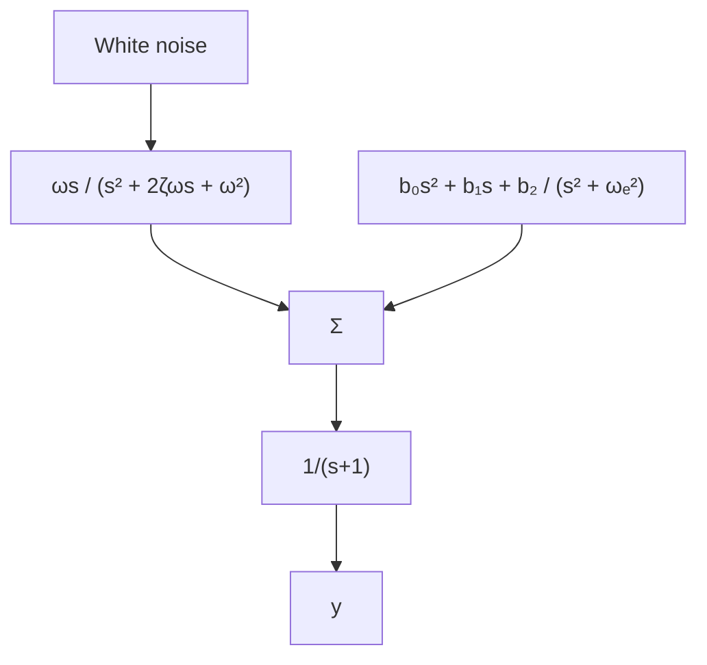

# EXAMPLE 1.8 Regulation of a quality variable in process control

Consider regulation of a quality variable of an industrial process in which there are disturbances whose characteristics are changing. A block diagram of the system is shown in Fig. 1.15. In the experiment it is assumed that the process dynamics are first order with time constant T = 1. It is assumed that the disturbance acts on the process input. The disturbance is simulated by sending white noise through a band-pass filter. The process dynamics are constant, but the frequency of the band-pass filter changes. Regulation can be done by a PI controller, but performance can be improved significantly by using a more complex controller that is tuned to the disturbance character. Such a controller has a very high gain at the center frequency of the disturbance. Figure 1.16 shows the control error under different conditions. The center frequency of the band-pass filter used to generate the disturbance is $\omega$ , and the corresponding value used in the design of the controller is $\omega_{e}$ . In Fig. 1.16(a) we show the control error obtained when the controller is tuned to the disturbance, that is, $\omega_{e} = \omega = 0.1$ . In Fig. 1.16(b) we illustrate what happens when the disturbance properties change. Parameter $\omega$ is changed to 0.05, while $\omega_{e} = 0.1$ . The performance of the control system now deteriorates significantly. In Fig. 1.16(c) we show the improvement obtained by tuning the controller to the new conditions, that is, $\omega = \omega_{e} = 0.05$ .

flowchart

Figure 1.15 Block diagram of the system with disturbances used in Example 1.8.

line

| Time | Output error |
| --- | --- |
| 0 | ~0 |
| 200 | ~0 |
| 400 | ~0 |
| 600 | ~0 |

line

| Time | Output error |
| --- | --- |
| 0 | ~0 |
| 200 | ~0 |
| 400 | ~0 |
| 600 | ~-1 |

