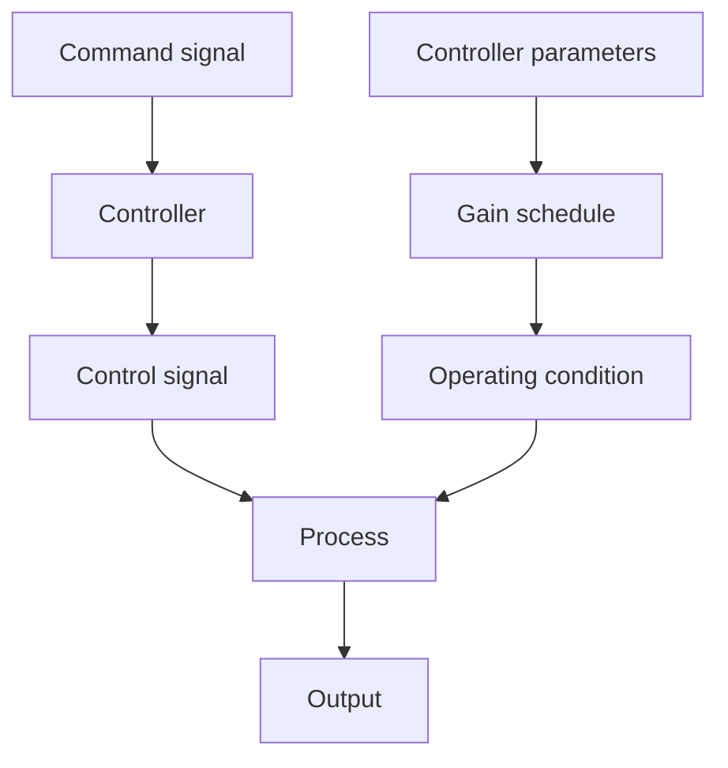

# Gain Scheduling

In many cases it is possible to find measurable variables that correlate well with changes in process dynamics. A typical case is given in Example 1.4. These variables can then be used to change the controller parameters. This approach is called gain scheduling because the scheme was originally used to measure the gain and then change, that is, schedule, the controller to compensate for changes in the process gain. A block diagram of a system with gain scheduling is shown in Fig. 1.17. The system can be viewed as having two loops. There is an inner loop composed of the process and the controller and an outer loop that adjusts the controller parameters on the basis of the operating conditions. Gain scheduling can be regarded as a mapping from process parameters to controller parameters. It can be implemented as a function or a table lookup.

The concept of gain scheduling originated in connection with the development of flight control systems. In this application the Mach number and the altitude are measured by air data sensors and used as scheduling variables. This was used, for instance, in the X-15 in Fig. 1.2. In process control the production rate can often be chosen as a scheduling variable, since time constants and time delays are often inversely proportional to production rate. Gain scheduling is thus a very useful technique for reducing the effects of parameter variations. Historically, it has been a matter of controversy whether gain scheduling should be considered an adaptive system or not. If we use the informal definition in Section 1.1 that an adaptive system is a controller with adjustable parameters and an adjustment mechanism, it is clearly adaptive. An in-depth discussion of gain scheduling is given in Chapter 9.

flowchart

Figure 1.17 Block diagram of a system with gain scheduling.
