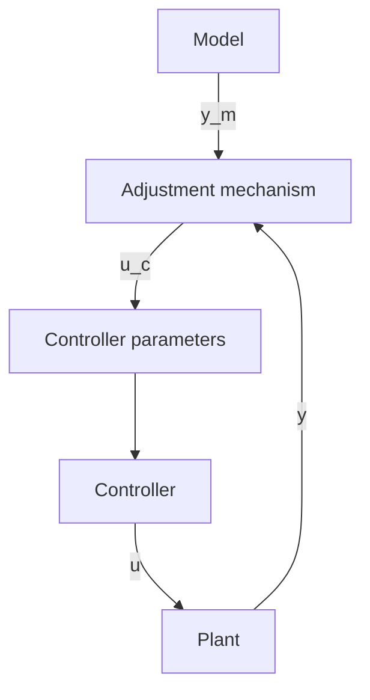

# Model-Reference Adaptive Systems (MRAS)

The model-reference adaptive system (MRAS) was originally proposed to solve a problem in which the performance specifications are given in terms of a reference model. This model tells how the process output ideally should respond to the command signal. A block diagram of the system is shown in Fig. 1.18. The controller can be thought of as consisting of two loops. The inner loop is an ordinary feedback loop composed of the process and the controller. The outer loop adjusts the controller parameters in such a way that the error, which is the difference between process output y and model output $y_{m}$ , is small. The MRAS was originally introduced for flight control. In this case the reference model describes the desired response of the aircraft to joystick motions.

The key problem with MRAS is to determine the adjustment mechanism so that a stable system, which brings the error to zero, is obtained. This problem is nontrivial. The following parameter adjustment mechanism, called the MIT rule, was used in the original MRAS:

$$\frac {d \theta}{d t} = - \gamma e \frac {\partial e}{\partial \theta} \tag {1.7}$$

In this equation, $e = y - y_{m}$ denotes the model error and $\theta$ is a controller parameter. The quantity $\partial e/\partial\theta$ is the sensitivity derivative of the error with respect to parameter $\theta$ . The parameter $\gamma$ determines the adaptation rate. In practice it is necessary to make approximations to obtain the sensitivity derivative. The MIT rule can be regarded as a gradient scheme to minimize the squared error $e^{2}$ .

flowchart

Figure 1.18 Block diagram of a model-reference adaptive system (MRAS).
