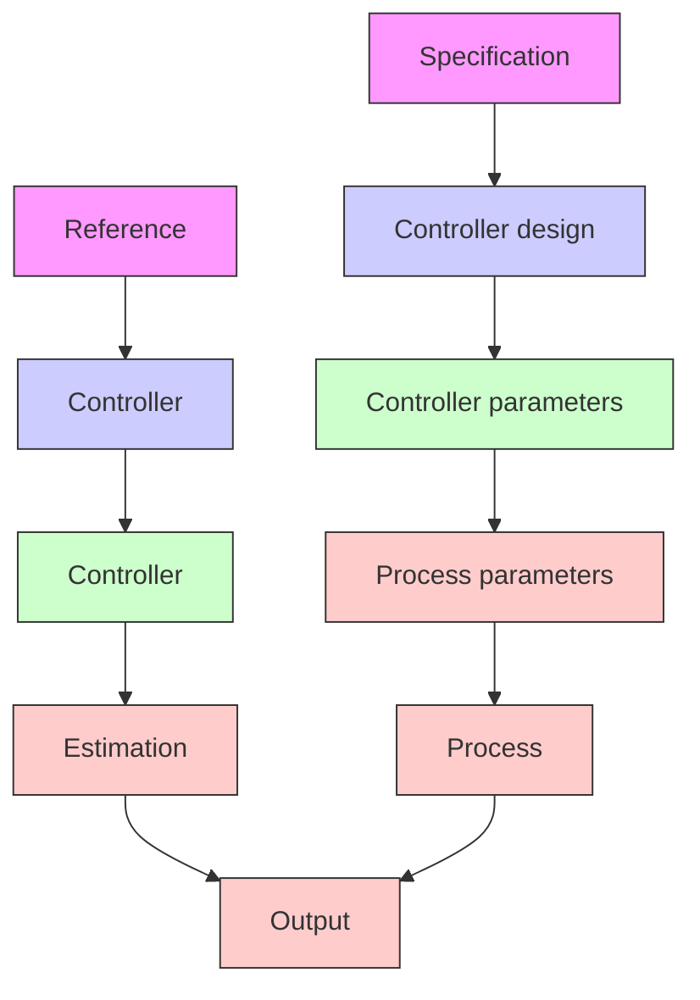

The STR scheme is very flexible with respect to the choice of the underlying design and estimation methods. Many different combinations have been explored. The controller parameters are updated indirectly via the design calculations in the self-tuner shown in Fig. 1.19. It is sometimes possible to reparameterize the process so that the model can be expressed in terms of the controller parameters. This gives a significant simplification of the algorithm because the design calculations are eliminated. In terms of Fig. 1.19 the block labeled “Controller design” disappears, and the controller parameters are updated directly.

flowchart

Figure 1.19 Block diagram of a self-tuning regulator (STR).

In the STR the controller parameters or the process parameters are estimated in real time. The estimates are then used as if they are equal to the true parameters (i.e., the uncertainties of the estimates are not considered). This is called the certainty equivalence principle. In many estimation schemes it is also possible to get a measure of the quality of the estimates. This uncertainty may then be used in the design of the controller. For example, if there is a large uncertainty, one may choose a conservative design. This is discussed in Chapter 7.
