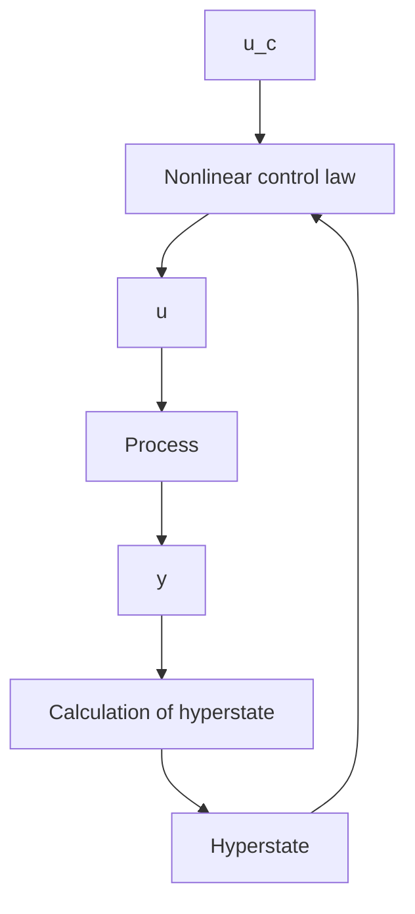

Figure 1.20 Block diagram of a dual controller.

$$V = E \left(G (z (T), u (T)) + \int_ {0} ^ {T} g (z, u) d t\right)$$

where E denotes mathematical expectation, u is the control variable, and G and g are scalar functions of z and u. The expectation is taken with respect to the distribution of all initial values and all disturbances appearing in the models of the system. The criterion V should be minimized with respect to admissible controls that are such that $u(t)$ is a function of past and present measurements and the prior distributions. The problem of finding a controller that minimizes the loss function is difficult. By making sufficient assumptions a solution can be obtained by using dynamic programming. The solution is then given in terms of a functional equation that is called the Bellman equation. This equation is an extension of the Hamilton-Jacobi equation in the calculus of variations. It is very difficult and time-consuming, if at all possible, to solve the Bellman equation numerically.

Some structural properties are shown in Fig. 1.20. The controller can be regarded as being composed of two parts: a nonlinear estimator and a feedback controller. The estimator generates the conditional probability distribution of the state from the measurements, $p(z|y,u)$ . This distribution is called the hyperstate of the problem. The feedback controller is a nonlinear function that maps the hyperstate into the space of control variables. This function could be computed off-line. The hyperstate must, however, be updated on-line. The structural simplicity of the solution is obtained at the price of introducing the hyperstate, which is a quantity of very high dimension. Updating of the hyperstate generally requires solution of a complicated nonlinear filtering problem. In simple cases the distribution can be characterized by its mean and covariance, as will be shown in Chapter 7.
