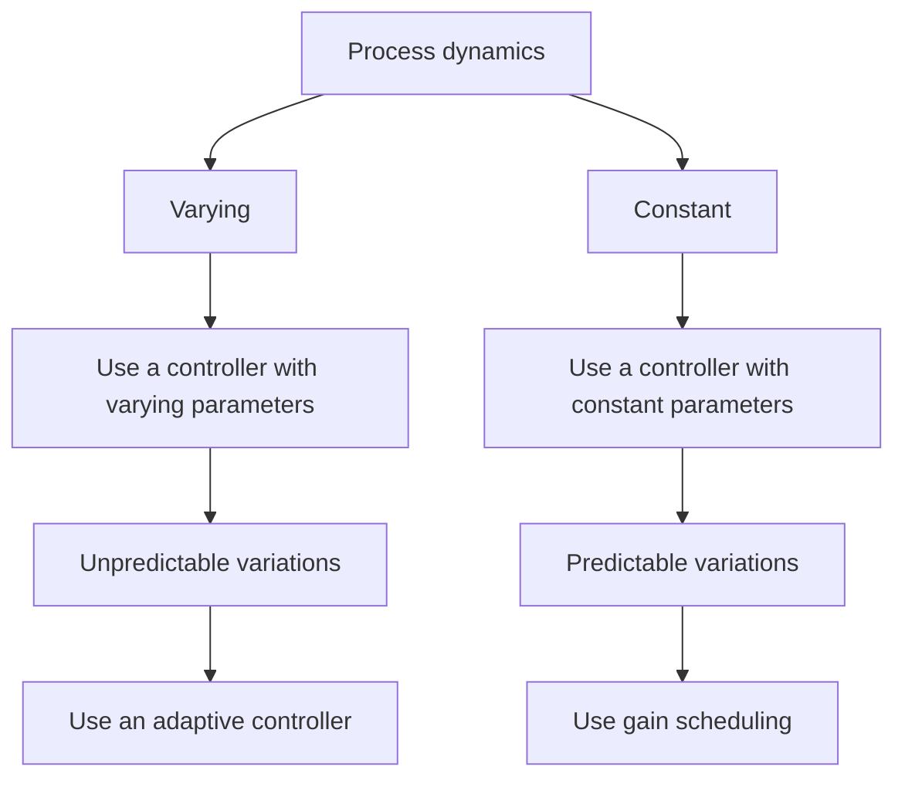

# Abuses of Adaptive Control

An adaptive controller, being inherently nonlinear, is more complicated than a fixed-gain controller. Before attempting to use adaptive control, it is therefore important to investigate whether the control problem might be solved by constant-gain feedback. In the literature on adaptive control there are many cases in which constant-gain feedback can do as well as an adaptive controller. This is one reason why we are discussing alternatives to adaptive control in this book. One way to proceed in deciding whether adaptive control should be used is sketched in Fig. 1.22.

flowchart

Figure 1.22 Procedure to decide what type of controller to use.
